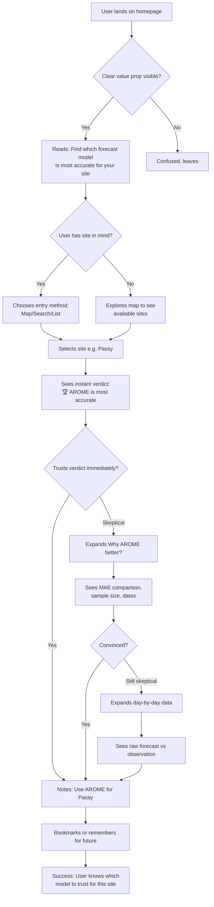
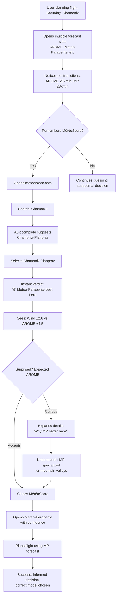
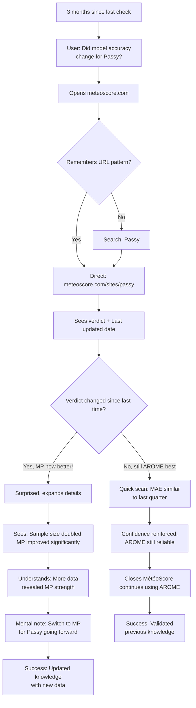

# UX Design Specification meteo-score

**Author:** boss
**Date:** 2026-01-10

---

<!-- UX design content will be appended sequentially through collaborative workflow steps -->

## Executive Summary

### Project Vision

MétéoScore is an open-source, data-driven web platform that objectively compares weather forecast model accuracy for paragliding sites in France. By systematically comparing forecast predictions against real-world beacon observations, MétéoScore eliminates cognitive biases (confirmation bias, aesthetic bias, selective amnesia) and provides pilots with objective data to identify which forecast model is most reliable for their specific flying location.

**Mission:** Replace subjective model preferences with transparent, data-backed comparisons that educate the paragliding community and drive industry-wide forecast accuracy improvements.

**Core Value:** "Which model should I trust for [this site]?" - answered with statistical evidence, not opinions.

**Usage Pattern:** Reference tool (not daily app) - consulted when discovering new sites/regions or quarterly to check if model performance has evolved.

### Target Users

**Primary Users:** Paragliders of all skill levels - from beginners to experienced pilots, local flyers and travelers, recreational and competitive.

**User Characteristics:**
- **Weather Data Literacy:** HIGH - Reading weather data is essential and primordial for all paragliders (safety-critical skill)
- **Technical Comfort:** Comfortable with meteorological concepts (wind speed/direction, temperature, MAE, biases)
- **Device Usage:** Mobile-first (field/parking lot consultations) + desktop (home planning) - both equally important
- **Frequency:** Sporadic usage pattern:
  - New site discovery (traveling, vacations, exploring new regions)
  - Quarterly checks to see if model performance has changed/improved
  - NOT a daily consultation tool

**Key User Insight:** Users value simplicity in UX (lesson from Meteo-Parapente's success despite average data quality) but are fully capable of understanding detailed statistical metrics.

### Key Design Challenges

**1. Simplicity vs. Precision Balance**
- Present complex statistical data (MAE, systematic biases, confidence intervals) in clear, accessible format
- Avoid overwhelming users while maintaining scientific rigor
- Mobile-first design with data-rich content (tables, charts) on small screens

**2. First-Time vs. Returning User Needs**
- First visit: Need educational context ("What is MAE?", "How to interpret biases?")
- Return visits: Direct access to updated numbers without re-explaining concepts
- Progressive disclosure strategy required

**3. Visual Credibility vs. Simplicity**
- Simple interface must not appear amateur or untrustworthy
- Scientific data presentation requires visual authority
- Balance clean design with trust signals (methodology transparency, sample size, data freshness)

**4. Mobile-First Data Presentation**
- Comparison tables across multiple models and parameters
- Charts showing error distributions and trends
- Timeline/calendar views with color-coded performance patterns (future enhancement)
- All must work seamlessly on small screens without endless scrolling

### Design Opportunities

**1. Radical Clarity Through Hierarchy**
- **Top Priority:** Clear verdict - "Model X is best for Site Y" (immediate answer)
- **Secondary:** Why it's best (bias characterization, MAE comparison)
- **Tertiary:** Statistical details for advanced users
- Progressive disclosure: simple default view, expandable details for curious users

**2. Integrated Education**
- Contextual explanations without cluttering primary content
- Visual aids to explain complex concepts (what MAE means in practical terms)
- Methodology transparency as trust-building element (not buried in footer)

**3. Intuitive Visual Patterns**
- Color-coding for performance (green = reliable, red = high error rates)
- Timeline/calendar visualization showing model performance over time (seasonal patterns, weather-dependent accuracy)
- Comparative views that make differences obvious at a glance

**4. Trust Through Transparency**
- Visible data freshness indicators (last update, sample size)
- Open methodology documentation accessible but non-intrusive
- Confidence levels clearly communicated ("Preliminary" vs. "Validated" results)
- GitHub link, open-source badge - reinforcing educational mission

**5. Differentiation from Existing Tools**
- Unlike Meteo-Parapente: Objective validation, not just beautiful UI
- Unlike forums/local knowledge: Data-driven, systematic, verifiable
- Clear positioning: "The reference for model accuracy, not a forecast provider"

**Key UX Strategy:** Combine Meteo-Parapente's UX simplicity success with MétéoScore's objective data rigor - proving that simple ≠ superficial, and data-driven ≠ complicated.

## Core User Experience

### Defining Experience

**Primary User Action:**
Compare weather forecast model accuracy for a specific paragliding site/region to determine which model to trust.

**Core Interaction Flow:**
1. **Site Selection:** User arrives and immediately sees navigation options:
   - Interactive map with site markers
   - Search bar for site/region name
   - List of available sites with current coverage
2. **Instant Verdict:** User selects site (e.g., "Passy") and sees immediate answer:
   - Clear winner declaration ("🏆 AROME is most accurate for Passy")
   - Comparative precision metrics by parameter (wind, temperature)
   - Visual hierarchy: verdict top, details below
3. **Progressive Disclosure:** User can dig deeper if skeptical or curious:
   - Expand parameter details (why AROME wins for wind specifically)
   - Access day-by-day comparison data (Model A forecast, Model B forecast, observed value)
   - Read methodology documentation for full transparency

**Experience Focus:**
Get the answer immediately, validate it thoroughly if needed. Not a daily tool - a reference that builds trust through transparency.

### Platform Strategy

**Platform:** Responsive web application (mobile-first, desktop-optimized)

**Device Strategy:**
- **Mobile:** Primary use case - consultation in field/parking, simple navigation optimized for touch
- **Desktop:** Secondary - home planning with more screen real estate for detailed data exploration
- **No offline requirement:** Sporadic usage pattern (site discovery, quarterly checks) doesn't justify PWA complexity

**Technical Approach:**
- Static or server-rendered pages for performance
- Responsive breakpoints optimized for phone (320-428px), tablet (768-1024px), desktop (1280px+)
- Touch-friendly tap targets (min 44x44px) for mobile interactions
- Mouse/keyboard optimized data tables for desktop power users

**Navigation Pattern:**
- **Entry Points:** Map, search, or list - user choice based on preference
- **Direct Access:** URL structure supports direct linking to sites (meteoscore.com/sites/passy)
- **Fast Load:** Results render immediately, no loading spinners or multi-step wizards

### Effortless Interactions

**Zero-Friction Areas:**

1. **Site Discovery:**
   - Map shows all available sites at a glance - no hunting through menus
   - Search autocomplete suggests sites as user types
   - Visual indicators show data quality (preliminary vs validated results)

2. **Verdict Understanding:**
   - NO jargon without translation:
     - ❌ "MAE: 3.2 km/h"
     - ✅ "Average error: ±3.2 km/h" or "Precision: ±3.2 km/h"
   - Visual comparison makes differences obvious without mental math:
     - Color-coding (green = best, yellow = acceptable, red = high error)
     - Side-by-side bars or metrics that highlight winner
   - Contextual units familiar to paragliders (km/h for wind, °C for temperature)

3. **Trust Building:**
   - Data freshness visible without clicking ("Updated 2 hours ago, 94 days of data")
   - Sample size shown prominently ("Based on 564 observations")
   - Confidence level clear ("Validated" badge after 90+ days, "Preliminary" warning before)
   - Methodology accessible but not intrusive (link in footer + expandable section)

4. **Detail Exploration:**
   - Expandable sections (not separate pages) - keep context visible
   - Day-by-day data in clean tables: Date | Model A | Model B | Observed | Error A | Error B
   - Charts show patterns at a glance (timeline with color-coded accuracy over time)

**Automatic Behaviors:**
- Best model auto-highlighted in comparison tables
- Results sorted by accuracy (best first)
- Mobile layout auto-optimizes tables for small screens (stacked cards vs wide tables)

### Critical Success Moments

**Make-or-Break Interactions:**

1. **First 5 Seconds (Success Moment):**
   - User lands on site page and immediately sees clear verdict
   - Visual hierarchy makes answer obvious: "🏆 AROME is most accurate"
   - Comparative metrics show WHY: "±3.2 km/h vs ±5.8 km/h"
   - User thinks: "Ah ouais, c'est exactement ce que je cherchais !"

2. **Trust Validation (Confidence Moment):**
   - Skeptical user expands details and sees:
     - Real observation data (not black box)
     - Day-by-day comparisons showing consistent pattern
     - Methodology explanation (transparent, not opaque)
   - User thinks: "OK, c'est crédible, c'est basé sur des vraies données"

3. **Parameter Differentiation (Insight Moment):**
   - User discovers nuance: "AROME meilleur pour vent, Meteo-Parapente équivalent pour température"
   - Progressive disclosure reveals this without overwhelming initial view
   - User thinks: "Intéressant, chaque modèle a ses forces"

**Failure Moments to Avoid:**

1. **Overwhelming Jargon:**
   - ❌ Page filled with MAE, RMSE, σ, p-values without explanation
   - ✅ Plain language with expandable technical details for advanced users

2. **Unclear Verdict:**
   - ❌ Just tables of numbers requiring manual comparison
   - ✅ Clear winner declaration with visual emphasis

3. **Missing Context:**
   - ❌ "AROME: 3.2" without units, timeframe, or sample size
   - ✅ "Based on 94 days (564 observations), AROME average error: ±3.2 km/h"

4. **Black Box Mystery:**
   - ❌ Results with no explanation of methodology
   - ✅ Transparent access to raw data and calculation methods

### Experience Principles

**Guiding UX Principles for All Design Decisions:**

1. **Verdict First, Details Second**
   - Answer the question immediately: "Which model is best?"
   - Support deep dives for skeptics, but don't require them for basic understanding
   - Progressive disclosure: simple → detailed → raw data

2. **Translate Jargon, Don't Hide It**
   - Use plain language for primary interface ("Average error" not "MAE")
   - Make technical terms available for advanced users (tooltips, expandable sections)
   - Assume weather literacy, not statistical literacy

3. **Trust Through Transparency, Not Authority**
   - Show sample sizes, data freshness, confidence levels prominently
   - Provide access to raw day-by-day data
   - Link to methodology without burying it
   - Open-source badge and GitHub link reinforce educational mission

4. **Mobile-First Simplicity, Desktop-Enhanced Detail**
   - Mobile: Clear verdict, essential metrics, touch-optimized navigation
   - Desktop: Additional charts, expanded tables, side-by-side comparisons
   - Both: Same information hierarchy, adapted layouts

5. **Instant Clarity Over Aesthetic Complexity**
   - Learn from Meteo-Parapente's UX success: simplicity drives adoption
   - Avoid over-designed dashboards that obscure the answer
   - Every visual element serves clarity, not decoration

6. **Data-Driven, Not Opinion-Based**
   - Never editorialize ("We think AROME is better")
   - Always quantify ("AROME shows 40% lower average error")
   - Let numbers speak, provide context, enable user judgment

## Desired Emotional Response

### Primary Emotional Goals

**Core Emotional State: Confidence**

Users should feel confident in their weather model choices after using MétéoScore. This confidence comes from:
- **Clarity:** Immediate, unambiguous answers to their questions
- **Transparency:** Full access to underlying data and methodology
- **Objectivity:** Data-driven verdicts, not opinions or marketing

**Secondary Emotions:**
- **Relief:** "Finally, a clear answer instead of guesswork"
- **Empowerment:** "I have the information to make informed decisions"
- **Respect for rigor:** "This is serious, professional work"

### Emotional Journey Mapping

**First Discovery (Homepage/Landing):**
- Curiosity: "What is this? How does it work?"
- Quick comprehension: "Oh, it compares model accuracy - that's useful"

**Site Selection:**
- Efficiency: "I can find my site quickly"
- Anticipation: "Let's see which model wins for Passy"

**Viewing Results (Critical Moment):**
- Immediate clarity: "AROME is best - got it"
- Confidence: "This makes sense, the numbers support it"
- Satisfaction: "Exactly what I needed to know"

**Exploring Details (Optional Deep Dive):**
- Trust validation: "The methodology is solid"
- Intellectual engagement: "Interesting patterns in the timeline"
- Reassurance: "The sample size is sufficient, this is credible"

**Returning Later (Quarterly Check):**
- Familiarity: "I know how this works"
- Efficiency: "Quick check to see if anything changed"
- Ongoing trust: "Still reliable, still transparent"

### Micro-Emotions

**Critical Emotional States:**

1. **Confidence > Confusion**
   - Users must understand results immediately without mental effort
   - Jargon translation prevents "I don't understand this" moments
   - Visual hierarchy guides comprehension

2. **Trust > Skepticism**
   - Transparency (sample sizes, dates, methodology) builds credibility
   - Access to raw data eliminates "black box" suspicion
   - Open-source positioning reinforces educational mission

3. **Satisfaction > Frustration**
   - Fast load times, no unnecessary clicks
   - Mobile-first prevents "hard to use on phone" annoyance
   - Progressive disclosure prevents overwhelming information dumps

4. **Respect > Dismissal**
   - Professional presentation without being sterile
   - Scientific rigor without academic pretension
   - Simple UI that doesn't look amateur

### Design Implications

**To Create Confidence:**
- Clear verdict typography (large, bold, unmissable)
- Side-by-side comparisons (no mental math required)
- Contextual explanations ("Based on 94 days, 564 observations")
- Trust signals visible but not intrusive

**To Prevent Confusion:**
- Translate all statistical jargon ("Average error" not "MAE")
- Visual coding (green/red) reinforces numerical differences
- Units always shown (km/h, °C, never ambiguous)
- Progressive disclosure: simple default, details on demand

**To Build Trust:**
- Methodology link prominent but not blocking
- Sample sizes and dates always visible
- GitHub link and open-source badge
- Day-by-day raw data accessible for verification

**To Ensure Satisfaction:**
- Zero unnecessary clicks to reach answer
- Fast page loads (static/server-rendered)
- Mobile-optimized layouts (no pinch-zoom on tables)
- Expandable sections keep context visible

### Emotional Design Principles

**Guiding Emotional Design Principles:**

1. **Clarity Breeds Confidence**
   - Every design decision prioritizes immediate comprehension
   - If a user has to think "what does this mean?", we failed
   - Plain language, visual coding, contextual units

2. **Transparency Builds Trust**
   - Show methodology, sample sizes, data freshness prominently
   - Never hide limitations (preliminary vs validated results)
   - Open-source ethos reinforced throughout

3. **Simplicity Prevents Confusion**
   - Learn from Meteo-Parapente: simple UI drives adoption
   - Progressive disclosure: simple → detailed → raw
   - Remove cognitive load at every opportunity

4. **Professionalism Earns Respect**
   - Clean, modern design without unnecessary ornamentation
   - Scientific rigor presented accessibly
   - Trust signals (sample sizes, dates) integrated naturally

**Emotional Anti-Patterns to Avoid:**

- ❌ Jargon without explanation → Confusion, intimidation
- ❌ Black box results → Skepticism, distrust
- ❌ Complex navigation → Frustration, abandonment
- ❌ Amateur visuals → Dismissal, lack of credibility

## UX Pattern Analysis & Inspiration

### Inspiring Products Analysis

**Primary Inspiration: Meteo-Parapente**

Meteo-Parapente serves as the UX north star for MétéoScore, demonstrating that simplicity drives adoption even when data quality isn't superior.

**What Works Well:**
- **Visual Simplicity:** Clean, uncluttered interface that doesn't overwhelm
- **Immediate Clarity:** Information hierarchy makes key data obvious at first glance
- **Minimalist Design:** No unnecessary UI elements or decorative complexity
- **Proven Adoption:** Despite average data quality, high usage due to UX ease

**Key Lesson:** Simplicity beats feature complexity for sporadic-use reference tools.

### Transferable UX Patterns

**From Meteo-Parapente:**
1. **Visual Minimalism:** Clean layouts with generous whitespace
2. **Information Hierarchy:** Most important data prominently displayed, details accessible but not blocking
3. **Color Coding:** Visual indicators reduce cognitive load (green/red patterns)
4. **Mobile-First Simplicity:** Touch-optimized, no complex interactions required

**Adaptation for MétéoScore:**
- Adopt minimalist visual approach
- Apply to data comparison context (side-by-side model metrics)
- Add transparency layer Meteo-Parapente lacks (methodology, sample sizes)
- Maintain simplicity while adding progressive disclosure for skeptical users

### Anti-Patterns to Avoid

**From Météo au ciel (Counter-Example):**
- ❌ **Overwhelming Complexity:** Too many features, cluttered interface
- ❌ **Information Overload:** All data shown simultaneously without hierarchy
- ❌ **Desktop-First Mindset:** Complex layouts that don't translate well to mobile
- ❌ **Feature Creep:** Adding functionality that obscures core value

**General Anti-Patterns:**
- ❌ **Jargon Without Translation:** Technical terms without plain language equivalents
- ❌ **Black Box Results:** Data without methodology or transparency
- ❌ **Complex Navigation:** Multi-step wizards or hidden information
- ❌ **Aesthetic Over Function:** Beautiful but confusing interfaces

### Design Inspiration Strategy

**What to Adopt:**
- **Meteo-Parapente's minimalism:** Clean layouts, generous whitespace, clear hierarchy
- **Épuré (refined) design philosophy:** Every element serves a purpose, no decoration for decoration's sake
- **Mobile-first simplicity:** Touch-friendly, fast-loading, optimized for small screens

**What to Adapt:**
- **Add transparency:** Unlike Meteo-Parapente, show methodology and data sources
- **Progressive disclosure:** Simple default view, expandable details for curious users
- **Data comparison focus:** Adapt minimalism to side-by-side model comparisons

**What to Avoid:**
- **Météo au ciel complexity:** Feature-heavy interfaces that obscure core value
- **Unnecessary ornamentation:** Stick to functional, clean design
- **Desktop-centric layouts:** Always design mobile-first, enhance for desktop

**Core Strategy:** Combine Meteo-Parapente's proven UX simplicity with MétéoScore's unique transparency and objectivity. Simple ≠ superficial, épuré ≠ lacking rigor.

## Design System Foundation

### Design System Choice

**Selected Stack: Solid.js + Tailwind CSS**

A lightweight, performant combination that balances component reusability with minimalist design philosophy.

**Technology Stack:**
- **Framework:** Solid.js (reactive UI library)
- **Styling:** Tailwind CSS (utility-first CSS framework)
- **Approach:** Component-based architecture with custom components

### Rationale for Selection

**Why Solid.js:**
1. **Performance-First:** No Virtual DOM overhead, compiled reactivity = ultra-fast
2. **Lightweight:** Small bundle size aligns with épuré design philosophy
3. **Component Reusability:** Perfect for repeated elements (comparison tables, charts, site cards)
4. **Server-Side Compatible:** Works with static/server-rendered approach
5. **React-Like Syntax:** Familiar developer experience with better performance
6. **Reactive Data:** Efficient updates when new forecast/observation data arrives

**Why Tailwind CSS:**
1. **Utility-First Flexibility:** Complete control over minimalist design
2. **No Bloat:** Only ships CSS you actually use (tree-shaking)
3. **Rapid Development:** Build custom épuré designs quickly without writing custom CSS
4. **Mobile-First:** Built-in responsive design utilities
5. **Customizable:** Full control over color palette, spacing, typography
6. **No Component Library Lock-In:** You build exactly what you need, nothing more

**Why This Combination:**
- Solid.js provides structure and reactivity for dynamic data (model comparisons, charts)
- Tailwind provides styling control for clean, minimalist aesthetic
- Both are lightweight and performant - no framework bloat
- Perfect balance: reusable components + design flexibility
- Aligned with Meteo-Parapente's simplicity philosophy while adding transparency features

**Why NOT Web Components:**
- More complex setup for this project scope
- Less ecosystem/tooling support
- Solid.js already provides component reusability
- Overkill for MétéoScore's requirements

### Implementation Approach

**Component Architecture:**

**Core Reusable Components:**
1. **SiteSelector** (Map, Search, List navigation)
2. **ModelComparison** (Side-by-side accuracy metrics)
3. **ParameterBreakdown** (Wind, Temperature detailed views)
4. **ConfidenceBadge** (Preliminary/Validated indicators)
5. **DataFreshness** (Last update, sample size display)
6. **ExpandableSection** (Progressive disclosure container)
7. **DayByDayTable** (Raw data comparison view)
8. **TimelineChart** (Color-coded performance over time - Phase 2)

**Solid.js Patterns:**
- Reactive stores for model comparison data
- Signal-based updates when new observations arrive
- Component composition for progressive disclosure
- Lazy loading for detail views (performance optimization)

**Tailwind Approach:**
- Custom color palette (green = accurate, red = high error, neutral grays)
- Typography scale optimized for data readability (mobile + desktop)
- Spacing system for generous whitespace (épuré aesthetic)
- Responsive breakpoints (320px mobile, 768px tablet, 1280px desktop)

### Customization Strategy

**Design Tokens (Tailwind Config):**

**Colors:**
```javascript
colors: {
  accurate: '#10b981', // Green for best models
  warning: '#f59e0b',  // Yellow for acceptable
  error: '#ef4444',    // Red for high error rates
  neutral: {
    50: '#fafafa',
    100: '#f5f5f5',
    // ... gray scale for backgrounds, text
  }
}
```

**Typography:**
- **Headings:** Bold, clear hierarchy for verdict declarations
- **Data Display:** Monospace for numerical comparisons (alignment)
- **Body Text:** Sans-serif, high readability for explanations

**Spacing:**
- Generous whitespace between sections (uncluttered)
- Compact within data tables (information density)
- Touch-friendly spacing for mobile tap targets (44x44px minimum)

**Component Customization:**
- Build custom components, not pre-packaged UI kit
- Every component serves specific MétéoScore need
- No unused code/components (keep bundle small)
- Accessibility baked in (ARIA labels, keyboard navigation)

**Brand Alignment:**
- Minimalist, épuré aesthetic (inspired by Meteo-Parapente)
- Scientific credibility through clean, professional design
- Trust signals integrated naturally (not intrusive)
- Open-source identity (subtle GitHub badge, footer link)

**Development Workflow:**
1. Set up Solid.js + Tailwind starter
2. Define custom Tailwind config (colors, spacing, typography)
3. Build core components (SiteSelector, ModelComparison first)
4. Implement progressive disclosure patterns
5. Optimize for mobile-first, enhance for desktop
6. Ensure accessibility compliance throughout

## 2. Core User Experience

### 2.1 Defining Experience

**The Defining Interaction: "Site Selection → Instant Verdict"**

MétéoScore's core experience is the moment when a paraglider selects their flying site and immediately receives a clear, confident answer: "Which forecast model should I trust here?"

This is MétéoScore's equivalent of:
- Tinder: "Swipe to match"
- Spotify: "Play any song instantly"
- MétéoScore: **"Select site → Get verdict instantly"**

**What Makes This Defining:**
- It's the reason users come to MétéoScore
- It solves the core problem in 5 seconds
- Everything else (details, methodology, charts) supports validating this verdict
- Users will describe MétéoScore to friends by explaining this interaction

**The Magic Moment:**
User lands on site page (e.g., "Passy") and sees:
```
🏆 AROME is most accurate for Passy

Wind: ±3.2 km/h average error (vs Meteo-Parapente ±5.8 km/h)
Temperature: ±1.1°C (vs Meteo-Parapente ±1.8°C)

Based on 94 days, 564 observations
```

In 5 seconds, user has confidence. Everything else is optional validation.

### 2.2 User Mental Model

**How Users Currently Solve This Problem:**

**Current Mental Model:**
1. Open 5-10 different weather forecast sites/apps
2. Compare predictions manually (wind, temperature, clouds)
3. Notice contradictions ("AROME says 15 km/h, Meteo-Parapente says 25 km/h")
4. Make gut-feel decision based on:
   - Personal preference ("I like AROME's interface")
   - Anecdotal experience ("AROME was right last time")
   - Peer pressure ("Locals use Meteo-Parapente")
   - Wishful thinking (choose forecast that supports desired activity)

**Pain Points in Current Model:**
- **Cognitive Load:** Mental comparison across multiple sources
- **No Memory:** Can't remember which model was accurate historically
- **No Objectivity:** Decisions based on biases, not data
- **Time-Consuming:** 10-15 minutes comparing sources

**MétéoScore's Mental Model Shift:**

**New Mental Model:**
1. "I want to fly at Passy tomorrow"
2. "Let me check MétéoScore to see which model to trust for Passy"
3. Instant answer: "AROME is best here"
4. Open AROME forecast with confidence

**Key Insight:** Users don't want MétéoScore to BE the forecast - they want it to tell them WHICH forecast to trust. It's a decision aid, not a replacement.

**Expected User Behavior:**
- First visit: "What is this? Oh, it compares accuracy - useful!"
- Site discovery: "Going to Chamonix next week, which model is best there?"
- Quarterly check: "Has AROME improved since last summer?"
- Validation: "I think AROME is best, let me confirm with data"

### 2.3 Success Criteria

**Core Experience Success Criteria:**

**1. Speed (5-Second Rule):**
- User lands on site page
- Within 5 seconds, user knows which model is best
- No loading spinners, no multi-step wizards
- Verdict visible above-the-fold on mobile

**2. Clarity (Zero Confusion):**
- User never thinks "I don't understand this"
- Verdict uses plain language ("AROME is most accurate" not "AROME: MAE 3.2")
- Visual hierarchy makes answer obvious (large, bold, top of page)
- Units always shown, context always provided

**3. Confidence (Trust Validation):**
- User believes the verdict (not skeptical)
- Sample size visible ("Based on 94 days")
- Data freshness shown ("Updated 2 hours ago")
- Methodology accessible (not hidden)

**4. Efficiency (Minimal Friction):**
- Zero unnecessary clicks from homepage to verdict
- Site selection fast (map/search/list - user choice)
- Mobile-optimized (no pinch-zoom, no horizontal scroll)
- Fast page load (<1 second)

**Success Indicators:**

**Moment of Success:**
- User sees verdict and immediately thinks: "Ah ouais, c'est exactement ce que je cherchais !"
- User feels empowered to make informed decision
- User trusts the answer without needing to dig into details (though they can)

**Behavioral Success:**
- User spends 30-60 seconds on first visit (quick answer, optional exploration)
- User returns quarterly to check updates
- User recommends MétéoScore to flying buddies
- User references MétéoScore in forum discussions ("According to MétéoScore, AROME is best for...")

**Failure Indicators (What to Avoid):**
- User spends >2 minutes trying to find answer (confusion)
- User leaves without understanding verdict (unclear design)
- User questions credibility (missing trust signals)
- User struggles on mobile (poor responsive design)

### 2.4 Novel UX Patterns

**Pattern Analysis: Established Patterns + Unique Twist**

MétéoScore uses **established patterns** with a **transparency twist**:

**Established Patterns We Adopt:**

1. **Comparison Tables** (familiar pattern)
   - Side-by-side metrics (users understand this)
   - Color coding (green = good, red = bad)
   - Sorting by best performance

2. **Progressive Disclosure** (proven pattern)
   - Summary → Details → Raw Data
   - Expandable sections (no page navigation)
   - Mobile-friendly accordions

3. **Search + Map + List Navigation** (multi-entry point)
   - Users pick their preferred discovery method
   - Common in travel/location-based apps

**Our Unique Twist: Radical Transparency**

**What Makes MétéoScore Different:**

Unlike typical comparison sites that say "Product X is best" without explanation, MétéoScore shows:
- **WHY:** Full methodology visible
- **HOW MUCH DATA:** Sample sizes, date ranges
- **HOW RECENT:** Last update timestamp
- **RAW EVIDENCE:** Day-by-day forecast vs. observation data

**Novel Element: Data Provenance as UX Feature**

Most data platforms hide methodology in footnotes. MétéoScore makes it a **trust-building UX element**:
- Confidence badges ("Validated" vs "Preliminary")
- Sample size prominently displayed
- GitHub link for full transparency
- Open-source positioning

**User Education Strategy:**

**No Novel Patterns Requiring Education:**
- We don't invent new interaction paradigms
- We use familiar patterns (tables, expandables, color codes)
- Innovation is in transparency, not interaction design

**Subtle Education Through Context:**
- First-time user sees "Average error: ±3.2 km/h" (plain language)
- Tooltip available: "MAE (Mean Absolute Error) = average difference between forecast and reality"
- Technical term accessible but not blocking

### 2.5 Experience Mechanics

**Detailed Flow: Site Selection → Instant Verdict**

**1. Initiation (How User Starts):**

**Entry Points (User Choice):**
- **Option A - Map:** Interactive map shows all sites with markers
- **Option B - Search:** Search bar with autocomplete ("Passy", "Chamonix", "Annecy")
- **Option C - List:** Scrollable list of sites sorted by region/popularity

**Visual Invitation:**
- Clear headline: "Find which forecast model is most accurate for your site"
- Three entry methods visually distinct but equal prominence
- Mobile: Stacked vertically, touch-optimized
- Desktop: Horizontal layout with map dominant

**2. Interaction (User Action):**

**Site Selection:**
- **Map Click:** User taps/clicks site marker → Site page loads
- **Search Select:** User types "Passy" → Autocomplete suggests → Select → Site page loads
- **List Tap:** User scrolls, taps "Passy Plaine Joux" → Site page loads

**System Response:**
- Instant page transition (no loading spinner if pre-rendered)
- URL updates: `meteoscore.com/sites/passy`
- Site page renders with verdict above-the-fold

**3. Feedback (How User Knows It's Working):**

**Immediate Visual Feedback:**

**Top of Page (Above-the-Fold on Mobile):**
```
🏆 AROME is most accurate for Passy Plaine Joux

┌─────────────────────────────────────────┐
│ Wind Accuracy                           │
│ AROME: ±3.2 km/h ████████░░ 85% ✓      │
│ Meteo-Parapente: ±5.8 km/h ████░░░░ 65%│
│                                         │
│ Temperature Accuracy                    │
│ AROME: ±1.1°C ████████░░ 88% ✓         │
│ Meteo-Parapente: ±1.8°C █████░░░ 72%   │
└─────────────────────────────────────────┘

📊 Based on 94 days, 564 observations
🕐 Updated 2 hours ago
✓ Validated results (90+ days of data)
```

**Visual Hierarchy:**
- Trophy emoji + bold headline = instant verdict
- Comparative bars show difference at a glance
- Green checkmarks on best model
- Trust signals below (sample size, freshness)

**Progressive Disclosure Available:**
- "Why is AROME better?" (expandable section)
- "See day-by-day data" (expandable table)
- "Methodology" (expandable or footer link)

**4. Completion (Success Outcome):**

**User Knows They're Done When:**
- They have clear answer: "AROME is best for Passy"
- They understand why: "Better wind accuracy (±3.2 vs ±5.8)"
- They trust it: "94 days of data, updated recently"

**Successful Outcome:**
- User closes MétéoScore
- Opens AROME forecast for Passy
- Plans flight with confidence

**Optional Next Actions:**
- Explore details (expand sections for curiosity)
- Check another site (search/map for next destination)
- Bookmark for future reference
- Share with friends

**Error Handling:**

**If Site Not Found:**
- Clear message: "We don't have data for this site yet"
- Explanation: "MétéoScore requires nearby observation beacons"
- Suggest similar sites with coverage

**If Data Preliminary:**
- Warning badge: "⚠️ Preliminary results (<30 days of data)"
- Explanation: "Confidence increases with more observations"
- Still show best-available verdict

**What's Next (Post-Verdict):**
- User returns to flight planning (mission accomplished)
- Quarterly return to check if rankings changed
- Recommend MétéoScore to flying community

## Visual Design Foundation

### Color System

**Visual Philosophy: Minimal, Élégant, Sobre**

Inspired by Zed Editor's sophisticated minimalism - clean, modern, elegant without unnecessary ornamentation.

**Color Palette:**

**Neutral Foundation (Light Mode):**
```javascript
colors: {
  neutral: {
    950: '#0A0A0A',  // Text primary (headings, body)
    800: '#2D2D2D',  // Text secondary
    600: '#6B6B6B',  // Labels, metadata
    300: '#E5E5E5',  // Borders, dividers
    100: '#F5F5F5',  // Subtle backgrounds
    50:  '#FAFAFA',  // Page background
  }
}
```

**Semantic Data Colors:**
```javascript
colors: {
  accurate: '#10B981',   // Green - Best performing model
  warning:  '#F59E0B',   // Amber - Acceptable performance
  error:    '#EF4444',   // Red - High error rates
  accent:   '#3B82F6',   // Blue - Links, interactive elements
}
```

**Dark Mode Support:**
- Background: #0A0A0A (deep black, not pure black)
- Text: #FAFAFA (off-white, easy on eyes)
- Semantic colors: Same (designed for both modes)
- Auto-inversion for borders and subtle backgrounds

**Accessibility:**
- All text/background combinations meet WCAG AA (4.5:1 minimum)
- Semantic colors tested for colorblind accessibility
- Focus states with 3:1 contrast minimum

**Color Application Strategy:**

**Trust Signals:**
- Validated badge: Green accent (#10B981)
- Preliminary warning: Amber accent (#F59E0B)
- Data freshness: Neutral 600 (#6B6B6B)

**Model Comparison:**
- Winner: Green background tint, green checkmark
- Runner-up: Neutral gray
- Poor performer: Red tint (subtle, not alarming)

**Progressive Disclosure:**
- Expandable sections: Neutral 100 background on hover
- Active state: Accent blue border
- Collapsed: Subtle neutral 300 border

### Typography System

**Type Family: Geist (Vercel Design System)**

**Rationale:**
- Ultra-modern, geometric, elegant
- Designed for digital interfaces (perfect readability)
- Complete family: Sans + Mono (consistency across UI)
- Open-source, performant variable font
- Aesthetic alignment with Zed Editor, Vercel, modern minimalism

**Type Scale & Hierarchy:**

**Headings (Geist Sans):**
```
H1 (Verdict/Page Title):
  font-family: 'Geist Sans', sans-serif
  font-size: 32px (2rem)
  line-height: 40px (2.5rem)
  font-weight: 600 (Semibold)
  letter-spacing: -0.02em (tight, modern)

H2 (Section Headers):
  font-size: 24px (1.5rem)
  line-height: 32px (2rem)
  font-weight: 600
  letter-spacing: -0.01em

H3 (Subsection Headers):
  font-size: 18px (1.125rem)
  line-height: 24px (1.5rem)
  font-weight: 500 (Medium)
  letter-spacing: -0.01em
```

**Body Text (Geist Sans):**
```
Body Regular:
  font-size: 16px (1rem)
  line-height: 24px (1.5rem)
  font-weight: 400
  letter-spacing: normal

Body Small (Metadata, Captions):
  font-size: 14px (0.875rem)
  line-height: 20px (1.25rem)
  font-weight: 400
  color: neutral-600

Body Emphasis:
  font-weight: 500 (Medium)
  color: neutral-950
```

**Data Display (Geist Mono):**
```
Metrics/Numbers (±3.2 km/h, 94 days):
  font-family: 'Geist Mono', monospace
  font-size: 18px (1.125rem)
  line-height: 24px (1.5rem)
  font-weight: 500
  tabular-nums (aligned columns)

Code/Technical:
  font-family: 'Geist Mono', monospace
  font-size: 14px
  background: neutral-100
  padding: 2px 6px
  border-radius: 4px
```

**Typographic Principles:**

1. **Hierarchy Through Weight & Size:**
   - Bold verdicts (600), medium sections (500), regular body (400)
   - Size jumps clear but not extreme (32 → 24 → 18 → 16)

2. **Tight Letter-Spacing for Headings:**
   - Modern, compact aesthetic (-0.02em on H1)
   - Improves readability at large sizes

3. **Generous Line-Height for Body:**
   - 1.5x ratio for comfortable reading
   - Reduces visual density, increases clarity

4. **Monospace for Data Alignment:**
   - Tabular numbers ensure column alignment
   - Critical for comparison tables

### Spacing & Layout Foundation

**Spacing Philosophy: Generous Whitespace, Uncluttered**

**Base Unit: 4px**

**Spacing Scale (4px increments):**
```javascript
spacing: {
  1:   '4px',   // Micro-spacing (tight inline elements)
  2:   '8px',   // Small gaps (icon + label)
  3:   '12px',  // Medium gaps (form fields)
  4:   '16px',  // Standard component padding
  6:   '24px',  // Card/section internal padding
  8:   '32px',  // Component separation
  12:  '48px',  // Section separation
  16:  '64px',  // Major block separation
  24:  '96px',  // Page section breaks
}
```

**Layout Grid:**

**Mobile (320-768px):**
- Single column
- 16px horizontal padding
- 32px vertical spacing between sections
- Full-bleed for maps/charts

**Tablet (768-1024px):**
- Flexible 2-column where appropriate
- 24px horizontal padding
- 48px vertical spacing

**Desktop (1024px+):**
- Max content width: 1280px (centered)
- 12-column grid (optional, mainly single/two-column layouts)
- 32px horizontal padding
- 64px vertical spacing between major sections

**Component Spacing Patterns:**

**Cards/Containers:**
- Internal padding: 24px (mobile), 32px (desktop)
- Border-radius: 8px (subtle roundness)
- Border: 1px neutral-300 (light, unobtrusive)

**Comparison Tables:**
- Row height: 56px (comfortable touch target)
- Cell padding: 12px horizontal, 16px vertical
- Row separation: 1px neutral-300 border

**Progressive Disclosure (Expandable Sections):**
- Header: 56px height (touch-friendly)
- Content padding: 24px
- Transition: 200ms ease-out (smooth, not sluggish)

**Touch Targets (Mobile):**
- Minimum: 44x44px (Apple/Google guidelines)
- Preferred: 48x48px (comfortable tapping)
- Spacing between targets: 8px minimum

**Whitespace Strategy:**

**Micro (Within Components):**
- Label + Value: 4px gap
- Icon + Text: 8px gap
- Form field stack: 12px gap

**Macro (Between Components):**
- Cards in list: 16px gap
- Section headers + content: 24px gap
- Major sections: 64px gap (generous breathing room)

**Visual Density:**
- **Dense areas:** Comparison tables (information-rich)
- **Airy areas:** Verdict section (focus attention)
- Balance: Information density where needed, whitespace for clarity

### Accessibility Considerations

**Color Accessibility:**

**Contrast Ratios (WCAG AA Compliant):**
- Text on background: ≥4.5:1 (neutral-950 on neutral-50 = 19:1 ✓)
- Large text (≥18px): ≥3:1 minimum
- UI components/focus states: ≥3:1

**Colorblind-Friendly Semantic Colors:**
- Green (#10B981): Distinguishable from red (#EF4444) in all colorblind types
- Icons/symbols supplement color (✓ checkmark, ⚠️ warning)
- Never rely on color alone (always text labels)

**Typography Accessibility:**

**Readability:**
- Minimum body text: 16px (comfortable for all ages)
- Line-height 1.5 (prevents line-jumping for dyslexia)
- No justified text (creates uneven spacing)
- Generous letter-spacing on headings (-0.02em is subtle, not extreme)

**Font Loading:**
- System font fallback during load (no FOIT - Flash of Invisible Text)
- Variable font = single file load (performance)

**Keyboard & Focus Accessibility:**

**Focus States:**
- 2px accent blue (#3B82F6) outline
- 4px offset for clarity
- Visible on all interactive elements
- Never `outline: none` without custom focus style

**Touch Accessibility:**
- 44px minimum touch targets
- Adequate spacing (8px) prevents mis-taps
- No hover-only interactions (mobile-first)

**Screen Reader Considerations:**
- Semantic HTML (not div soup)
- ARIA labels on interactive elements
- Skip-to-content link
- Landmark regions (header, main, footer, navigation)

**Motion Accessibility:**
- Respect `prefers-reduced-motion`
- Smooth transitions disabled for users who request it
- Essential animations only (expandable sections can be instant-toggle)

**Implementation Notes:**
- Geist font loaded via CDN or self-hosted
- CSS custom properties for theming (easy dark mode switch)
- Tailwind config maps to design tokens
- Component library (Solid.js) enforces spacing/typography consistency

## Design Direction Decision

### Design Directions Explored

**Single Coherent Direction: Modern Minimalism (Zed-Inspired)**

Rather than exploring multiple divergent directions, we established a cohesive design vision from the start:

**Visual References:**
- Zed Editor: Sophisticated minimalism, modern geometric typography, generous whitespace
- Vercel Design System (Geist): Clean, data-focused, professional
- Modern SaaS: Confidence through simplicity, not decoration

**Core Philosophy:**
Combine Meteo-Parapente's proven UX simplicity with MétéoScore's transparency and rigor. Simple ≠ superficial, épuré ≠ lacking depth.

### Chosen Direction

**Direction: Minimal Data-Focused Interface**

**Layout Approach:**
- **Homepage:** Three entry points (Map, Search, List) - equal prominence, user choice
- **Site Page:** Verdict-first hierarchy - answer above-the-fold, details via progressive disclosure
- **Mobile-first:** Single column, touch-optimized, generous tap targets
- **Desktop-enhanced:** Side-by-side comparisons, expanded charts, more screen real estate

**Visual Treatment:**
- **Typography:** Geist Sans (headings/body) + Geist Mono (data) - cohesive, modern
- **Color:** Neutral foundation (#FAFAFA bg, #0A0A0A text) + semantic data colors (green/amber/red)
- **Spacing:** Generous whitespace (64px major sections), uncluttered, breathing room
- **Components:** Custom-built (not pre-packaged), every element serves purpose

**Interaction Style:**
- **Progressive Disclosure:** Summary → Details → Raw Data (expandable sections, not page navigation)
- **Trust Signals:** Prominent but not intrusive (sample sizes, dates, methodology links)
- **Speed:** <1s page loads, instant transitions, no spinners
- **Accessibility:** WCAG AA, keyboard-friendly, screen-reader optimized

**Navigation Pattern:**
- **Multi-Entry Homepage:** Map/Search/List - users pick preferred method
- **Direct URLs:** `meteoscore.com/sites/passy` - shareable, bookmarkable
- **Minimal Chrome:** Simple header (logo, GitHub link), footer (methodology, about)

### Design Rationale

**Why This Direction:**

1. **Alignment with Product Vision:**
   - Reference tool (not daily app) = no need for complex navigation
   - Sporadic usage = clarity over feature richness
   - Trust-building = transparency through design (visible data provenance)

2. **User Mental Model:**
   - Paragliders already weather-data literate = no need for oversimplification
   - Want quick verdict + validation option = progressive disclosure perfect fit
   - Appreciate minimalism (Meteo-Parapente success) = épuré aesthetic

3. **Technical Constraints:**
   - Solo developer = simple design system easier to maintain
   - Static/server-rendered = fast, no complex client state
   - Solid.js + Tailwind = matches minimalist, performance-first philosophy

4. **Emotional Goals:**
   - Confidence = clear verdict typography, obvious visual hierarchy
   - Trust = transparent methodology, visible sample sizes
   - Satisfaction = fast answers, no cognitive load

5. **Differentiation:**
   - Unlike Meteo-Parapente: Adds transparency (methodology, raw data)
   - Unlike Météo au ciel: Removes complexity (focused, uncluttered)
   - Unique positioning: Simple interface + rigorous data

**Design Validation:**

This direction achieves all our core principles:
- ✅ Verdict First, Details Second (progressive disclosure)
- ✅ Translate Jargon, Don't Hide It (plain language + tooltips)
- ✅ Trust Through Transparency (visible methodology, sample sizes)
- ✅ Mobile-First Simplicity (touch-optimized, generous whitespace)
- ✅ Instant Clarity Over Aesthetic Complexity (functional, not decorative)
- ✅ Data-Driven, Not Opinion-Based (quantified, contextualized)

### Implementation Approach

**Phase 1: Foundation Components (Week 1-2)**

**Core Components:**
1. **SiteSelector** (Map + Search + List)
2. **VerdictHeader** (Trophy + Model name + Key metrics)
3. **ComparisonTable** (Side-by-side model performance)
4. **ConfidenceBadge** (Validated/Preliminary indicator)
5. **ExpandableSection** (Progressive disclosure container)

**Design System Setup:**
- Tailwind config with custom Geist fonts, color palette, spacing scale
- CSS custom properties for dark mode theming
- Solid.js reactive stores for theme switching

**Phase 2: Site Page (Week 3)**

**Layout:**
```
┌─────────────────────────────────────┐
│ Header (Logo, GitHub)               │
├─────────────────────────────────────┤
│ 🏆 AROME is most accurate (Verdict)│
│                                     │
│ Wind: ±3.2 vs ±5.8 (Comparison)    │
│ Temp: ±1.1 vs ±1.8                 │
│                                     │
│ 📊 94 days, 564 obs (Trust signals)│
├─────────────────────────────────────┤
│ ▼ Why is AROME better? (Expandable)│
├─────────────────────────────────────┤
│ ▼ See day-by-day data (Expandable) │
├─────────────────────────────────────┤
│ Footer (Methodology, About)         │
└─────────────────────────────────────┘
```

**Responsive Behavior:**
- Mobile: Stacked, full-width, 16px padding
- Desktop: Max-width 1280px, centered, 32px padding

**Phase 3: Homepage (Week 4)**

**Three Entry Points:**
- **Map:** Interactive Leaflet/Mapbox with site markers
- **Search:** Autocomplete (Algolia-style) with site suggestions
- **List:** Sorted by region, filterable

**Implementation:**
- Lazy-load map (performance)
- Debounced search (no API spam)
- Virtual scrolling for long lists (performance)

**Phase 4: Polish & Details (Week 5)**

**Enhancements:**
- Dark mode toggle (respect system preference)
- Skeleton loaders (perceived performance)
- Error states (site not found, preliminary data)
- 404 page (elegant, helpful)
- About/Methodology pages (transparency)

**Design Quality Assurance:**
- Accessibility audit (WAVE, axe DevTools)
- Responsive testing (320px to 1920px)
- Performance testing (Lighthouse)
- Browser testing (Chrome, Firefox, Safari)

**Design Iteration:**
- Collect user feedback after MVP launch
- A/B test verdict presentation variations
- Refine color coding based on real data patterns
- Adjust spacing if mobile feels cramped
## User Journey Flows

### Journey 1: First-Time Discovery

**User Goal:** Discover what MétéoScore is and understand its value

**Entry Point:** Friend recommendation, forum link, Google search

**Flow:**



**Success Criteria:**
- User understands value proposition in <10 seconds
- User gets verdict in <5 seconds after site selection
- User trusts verdict (either immediately or after validation)
- User remembers: "MétéoScore = check which model is best"

**Failure Points & Recovery:**
- Homepage unclear → Add explicit tagline, visual examples
- Site not found → Suggest similar sites, explain coverage
- Distrust verdict → Progressive disclosure successful, raw data convinces

---

### Journey 2: Site Discovery (Planning Flight to New Site)

**User Goal:** Determine which forecast model to trust for upcoming flight at unfamiliar site

**Context:** User planning weekend trip to Chamonix, hasn't flown there before

**Flow:**



**Success Criteria:**
- User finds site quickly (<10 seconds search/autocomplete)
- Verdict clear even when unexpected (MP > AROME)
- User trusts data-driven recommendation over personal bias
- User applies knowledge immediately (opens correct forecast)

**Key Insight:**
This journey proves MétéoScore's core value - overcoming confirmation bias. User expected AROME, data says MP, user trusts data.

---

### Journey 3: Quarterly Validation (Returning User)

**User Goal:** Check if model rankings have changed for local site

**Context:** Local pilot at Passy, checks MétéoScore every 3 months

**Flow:**



**Success Criteria:**
- Returning user finds info even faster (<30 seconds total)
- Last updated timestamp builds trust
- Sample size growth visible (564 → 1200 observations)
- User accepts changed rankings when data supports it

**Design Implications:**
- Show "Last updated" prominently
- Highlight sample size growth since last visit
- Consider "What's changed?" section for returning users

---

### Journey 4: Deep Dive Validation (Skeptical User)

**User Goal:** Validate MétéoScore's methodology and data sources before trusting

**Context:** Data-driven pilot, skeptical of "yet another weather comparison site"

**Flow:**

```mermaid
flowchart TD
    A[User: Another comparison site?<br/>Is this legit?] --> B[Lands on Passy site page]

    B --> C[Sees verdict but skeptical]
    C --> D[Looks for: How is this calculated?]

    D --> E[Finds: Methodology link in footer]
    E --> F[Reads: MAE calculation explained,<br/>data sources listed]

    F --> G{Methodology sound?}
    G -->|No| Z[Leaves unconvinced]
    G -->|Yes, but want proof| H[Returns to site page]

    H --> I[Expands: See day-by-day data]
    I --> J[Table: Date | AROME Forecast |<br/>MP Forecast | Observed | Errors]

    J --> K[Spot checks: 2024-01-15<br/>AROME 18, Observed 17 ✓]
    K --> L[Multiple dates verified]

    L --> M{Data looks real?}
    M -->|Fabricated/fishy| Z
    M -->|Legit| N[Checks: Where's observation from?]

    N --> O[Sees: ROMMA Passy beacon<br/>FFVL network]
    O --> P[Googles ROMMA beacon<br/>Confirms it's real]

    P --> Q[Sees GitHub link:<br/>Open source code]
    Q --> R[Visits repo, sees:<br/>- Real commits<br/>- Data pipeline code<br/>- Transparent]

    R --> S[Fully convinced:<br/>This is legit]
    S --> T[Bookmarks, shares with<br/>flying community]

    T --> U[Success: Skeptic converted<br/>to advocate]
```

**Success Criteria:**
- Methodology accessible but not blocking primary flow
- Raw data available for validation
- Data provenance clear (ROMMA, FFVL sources)
- Open-source positioning builds trust
- Skeptic can fully validate without contacting anyone

**Critical Trust Elements:**
- Methodology page with calculation details
- Day-by-day raw data table
- Observation source attribution
- GitHub repository link
- Sample size + date range visible

---

### Journey Patterns

**Common Patterns Across All Journeys:**

**1. Progressive Trust Building:**
```
Instant Verdict (surface)
    ↓ (skeptical?)
Why it's better (layer 1)
    ↓ (still skeptical?)
Raw data proof (layer 2)
    ↓ (still skeptical?)
Methodology + open source (layer 3)
```

**2. Multi-Entry Navigation:**
- Every journey allows Map, Search, or List entry
- Users pick method matching their mental model
- No forced linear path

**3. Fast Exit After Success:**
- Users get answer quickly
- Close MétéoScore, open chosen forecast
- Sporadic usage pattern supported

**4. Transparent Data Provenance:**
- Sample size always visible
- Last updated timestamp prominent
- Observation source attribution clear

**5. Mobile-First Speed:**
- No multi-step wizards
- Above-the-fold verdicts
- Touch-optimized interactions

---

### Flow Optimization Principles

**1. Minimize Time to Verdict:**
- Homepage → Site selection → Verdict = 2 clicks maximum
- Direct URLs bypass homepage entirely
- Autocomplete reduces typing to 3-5 characters

**2. Support Multiple Confidence Levels:**
- Trusting users: Verdict alone suffices (5 seconds)
- Cautious users: Expand details (30 seconds)
- Skeptical users: Full validation available (2-3 minutes)

**3. Preserve Context:**
- Expandable sections don't navigate away
- User never loses sight of primary verdict
- Progressive disclosure maintains scroll position

**4. Enable Learning:**
- First visit: Educational (What is MAE? Why trust this?)
- Return visits: Efficient (Direct to verdict, check updates)
- Pattern: Guided → Self-service

**5. Build Trust Through Transparency:**
- Never hide methodology
- Always show sample sizes
- Expose raw data freely
- Link to open source code

**6. Respect Sporadic Usage:**
- No accounts/login required
- Bookmarkable URLs
- No "onboarding tours" blocking usage
- Instant value, no commitment

**7. Handle Edge Cases Gracefully:**
- Site not found → Suggest alternatives
- Preliminary data → Clear warning + explanation
- Tied models → Show both, explain tie
- No recent updates → Explain data pipeline issue

**8. Mobile Performance:**
- <1 second page loads (static/server-rendered)
- No layout shifts (reserved space for async content)
- Touch targets 44px+ (fat-finger friendly)
- No hover-only interactions

---

## Component Strategy

### Design System Components

**Available from Tailwind CSS + Solid.js:**

Tailwind CSS provides a comprehensive utility-first framework with:
- **Layout primitives:** Grid, Flexbox, spacing utilities
- **Typography system:** Font sizes, weights, line heights
- **Color utilities:** Full palette with opacity variants
- **Interactive states:** Hover, focus, active, disabled
- **Responsive breakpoints:** Mobile-first adaptive design

**Components Needed for MétéoScore:**

Based on our user journey analysis, MétéoScore requires 12 custom components organized into three functional groups:

**1. Homepage Entry Points:**
- SiteMap - Interactive geographic visualization
- SiteSearch - Autocomplete search interface
- SiteList - Filterable region-based list

**2. Site Page Verdict Display:**
- VerdictHeader - Primary verdict presentation
- ComparisonTable - Model performance comparison
- ParameterCard - Parameter-specific breakdown
- ConfidenceBadge - Data maturity indicator
- DataFreshness - Update recency and sample size

**3. Progressive Disclosure & Navigation:**
- ExpandableSection - Accordion pattern wrapper
- DayByDayTable - Raw forecast vs observation data
- Header - Global navigation and branding
- Footer - Methodology and transparency links

**Gap Analysis:**

Tailwind provides styling primitives but not specialized components:
- **Geographic visualization** → Custom SiteMap needed
- **Data comparison tables** → Custom ComparisonTable with semantic coloring
- **Trust indicators** → Custom ConfidenceBadge and DataFreshness
- **Progressive disclosure** → Custom ExpandableSection wrapper
- **Domain-specific displays** → All components use Geist typography + neutral palette tokens

---

### Custom Components

#### **1. SiteMap**

**Purpose:** Geographic visualization of paragliding sites with accuracy indicators

**Usage:** Homepage alternative to search/list, provides spatial context for site distribution

**Anatomy:**
- Interactive map canvas (Leaflet or MapLibre GL)
- Colored markers indicating verdict status (green/amber/red)
- Hover tooltips showing site name + MAE verdict
- Zoom and pan controls
- Legend explaining marker colors

**States:**
- **Default:** Map centered on France, all site markers visible
- **Hover marker:** Tooltip appears with site name + verdict summary
- **Active marker:** Selected marker with pulse animation
- **Loading:** Skeleton placeholder with neutral gray background
- **Error:** Message "Carte temporairement indisponible" with fallback to SiteList

**Variants:**
- **Desktop:** Full-width, 400px height
- **Mobile:** Full-width, 280px height, touch-optimized controls

**Accessibility:**
- `role="application"` on map container
- Keyboard navigation: Tab cycles through markers, Enter selects
- Screen reader: Alternative list of sites below map (visually hidden)
- `aria-label` on markers: "Site [name], verdict: [status]"

**Content Guidelines:**
- Maximum 50 sites displayed simultaneously
- Cluster markers when >10 sites within close proximity
- Tooltip format: "**Site Name** - MAE: X.X°C"

**Interaction Behavior:**
- Click marker → Navigate to `/sites/:slug`
- Adaptive zoom based on number of visible sites
- Preserve viewport state on navigation return
- Debounce zoom/pan events for performance

---

#### **2. SiteSearch**

**Purpose:** Fast site discovery through name or region search

**Usage:** Primary entry point on homepage, above fold

**Anatomy:**
- Full-width input field with rounded corners
- Search icon (magnifying glass) on left side
- Dropdown results panel (max 5 suggestions)
- Region badges within results (gray, subtle)
- Clear button (X) when text entered

**States:**
- **Default:** Placeholder text "Rechercher un site..."
- **Focus:** Border changes to accent blue, dropdown appears empty
- **Typing:** Results filter in real-time, top 5 matches shown
- **No results:** Dropdown shows "Aucun site trouvé" in gray
- **Error:** Red border with error message below input
- **Selected:** Input fills with selected site name

**Variants:**
- Single responsive variant (adapts typography/padding)

**Accessibility:**
- `role="combobox"` with `aria-expanded` attribute
- `aria-autocomplete="list"` for predictive behavior
- `aria-activedescendant` for keyboard selection
- Announce result count for screen readers: "5 résultats disponibles"
- Escape key closes dropdown

**Content Guidelines:**
- Results sorted by relevance (Fuse.js fuzzy matching)
- Display format: **Site Name** (Region, Department)
- Match highlighting: Bold matched characters

**Interaction Behavior:**
- 200ms debounce on keypress for API efficiency
- Arrow up/down navigate results
- Enter selects highlighted result
- Click outside dropdown closes it
- Clear button (X) resets input and closes dropdown

---

#### **3. SiteList**

**Purpose:** Complete browsable list of sites with region filtering

**Usage:** Third entry point option (Map/Search/List pattern)

**Anatomy:**
- Horizontal scrollable region filter chips
- Stacked site cards in grid layout
- Each card contains: Site name, region, verdict badge
- Load more trigger at bottom (lazy loading)

**States:**
- **Default:** All sites displayed, no filter active
- **Filtered:** Specific region selected, list shows subset
- **Loading:** Skeleton cards with pulsing gray blocks
- **Empty filter:** "Aucun site dans cette région"
- **End of list:** "Tous les sites chargés" message

**Variants:**
- **Desktop:** 3-column grid
- **Tablet:** 2-column grid
- **Mobile:** Single column

**Accessibility:**
- `role="list"` with `role="listitem"` for semantic structure
- Filter chips with `aria-pressed` for toggle state
- Focus visible styles on all interactive elements
- Keyboard: Tab through cards, Enter to navigate

**Content Guidelines:**
- 20 sites per page with infinite scroll
- Alphabetical order by default
- Region filters: All major French regions

**Interaction Behavior:**
- Click region filter chip → Toggle filter on/off
- Click site card → Navigate to `/sites/:slug`
- Scroll to bottom → Load next 20 sites automatically
- Multiple filters can be active (OR logic)

---

#### **4. VerdictHeader**

**Purpose:** Immediate visual presentation of forecast accuracy verdict

**Usage:** Top section of every site page, first thing users see

**Anatomy:**
- Trophy icon (left, SVG, colored by verdict)
- Verdict headline (H1, Geist Sans 600)
- Subtitle with best model name + MAE values
- ConfidenceBadge component (Validated/Preliminary)

**States:**
- **Accurate:** Green trophy, headline "AROME le plus précis"
- **Warning:** Amber trophy, headline "AROME acceptable"
- **Error:** Red trophy, headline "Tous les modèles peu précis"
- **Loading:** Skeleton with pulsing blocks

**Variants:**
- Single responsive variant (typography scales with viewport)

**Accessibility:**
- Semantic `<h1>` for page title hierarchy
- `aria-label` on trophy icon describing verdict status
- WCAG AA contrast ratio on all color combinations
- Trophy color not sole indicator (text reinforces meaning)

**Content Guidelines:**
- Verdict format: "[Model Name] le plus précis"
- Subtitle format: "MAE : X.X°C / X.X km/h sur 90 jours"
- Numbers in Geist Mono with tabular-nums

**Interaction Behavior:**
- Static display (no user interaction)
- Subtle fade-in animation on page load
- Trophy icon scales slightly on hover (optional delight)

---

#### **5. ComparisonTable**

**Purpose:** Side-by-side performance comparison of all forecast models

**Usage:** Main content section below VerdictHeader

**Anatomy:**
- Header row: "Modèle | MAE Vent | MAE Temp | Score Global"
- Data rows: One per model (AROME, Meteo-Parapente, etc.)
- Semantic color coding: Green highlight for best values
- Footer: Analysis period + sample size metadata

**States:**
- **Default:** All models displayed, best values highlighted
- **Hover row:** Very subtle gray background (#F5F5F5)
- **Sorted:** Arrow indicator in clicked column header
- **Mobile:** Transform to stacked cards (columns become rows)

**Variants:**
- **Desktop:** Classic 4-column table layout
- **Mobile:** Cards stacked vertically, one per model

**Accessibility:**
- Semantic `<table>` with `<thead>`, `<tbody>`, `<tfoot>`
- `scope="col"` on column headers
- `aria-sort` attribute when sorting enabled
- Numbers readable by screen readers with proper units

**Content Guidelines:**
- All numbers in Geist Mono with tabular-nums
- Units as light superscript (°C, km/h)
- Best score bolded (font-weight: 600)
- Highlight best value per column in green

**Interaction Behavior:**
- Click column header → Sort by that metric (optional)
- Horizontal scroll on mobile if table too wide
- No row selection needed (read-only data)

---

#### **6. ParameterCard**

**Purpose:** Detailed accuracy breakdown by individual parameter (wind/temperature)

**Usage:** Expandable section below ComparisonTable (progressive disclosure)

**Anatomy:**
- Card header: Parameter name (Vent/Température) + icon
- Simple bar chart showing MAE per model
- Ranked list of models by performance
- Metadata: Analysis hours (6h, 12h, 18h breakdown)

**States:**
- **Collapsed:** Header only (controlled by ExpandableSection wrapper)
- **Expanded:** Full card content visible
- **Loading:** Skeleton chart with gray bars
- **No data:** Message "Données insuffisantes pour ce paramètre"

**Variants:**
- **Wind Card:** Wind icon, km/h units
- **Temperature Card:** Thermometer icon, °C units

**Accessibility:**
- Chart with `role="img"` and descriptive `aria-label`
- Data table alternative (visually hidden for screen readers)
- Keyboard accessible when expanded

**Content Guidelines:**
- Bar chart heights proportional to MAE values
- Consistent color legend (green/amber/red thresholds)
- Y-axis labeled with units

**Interaction Behavior:**
- Expansion controlled by ExpandableSection parent
- Hover over bars → Tooltip with exact value
- Chart renders responsively (SVG or canvas)

---

#### **7. ConfidenceBadge**

**Purpose:** Data maturity indicator showing validation status

**Usage:** Next to verdict in VerdictHeader, inline with key metrics

**Anatomy:**
- Pill-shaped badge with icon + text
- **Validated:** Checkmark icon + "90 jours validés"
- **Preliminary:** Clock icon + "Données préliminaires (X jours)"

**States:**
- **Validated:** Light green background (#D1FAE5), dark green text (#065F46)
- **Preliminary:** Light amber background (#FEF3C7), dark amber text (#92400E)

**Variants:**
- **Validated badge:** 90+ days of data
- **Preliminary badge:** <90 days of data

**Accessibility:**
- `role="status"` for screen reader announcement
- Icon decorative with `aria-hidden="true"`
- Text provides full context (icon redundant)
- WCAG AA contrast on all combinations

**Content Guidelines:**
- Concise text (max 4-5 words)
- Dynamic day count for Preliminary: "(23 jours)"
- Clear status without jargon

**Interaction Behavior:**
- Hover → Tooltip with detailed explanation
- Optional click → Scroll to methodology section
- Static badge (no complex interactions)

---

#### **8. DataFreshness**

**Purpose:** Transparency about data recency and sample size

**Usage:** Footer of data sections (ComparisonTable, ParameterCards)

**Anatomy:**
- Clock icon (left, subtle gray)
- Primary text: "Mis à jour : [relative date]"
- Secondary text: "N prévisions analysées"

**States:**
- **Fresh (<24h):** Dark gray text (#2D2D2D)
- **Stale (>7 days):** Amber text (#F59E0B) with warning icon
- **Error:** Red text with "Données non disponibles"

**Variants:**
- Single variant with conditional styling based on freshness

**Accessibility:**
- Semantic `<time datetime="...">` element
- Screen reader friendly date format: "Mis à jour il y a 2 heures"
- ISO 8601 datetime attribute for precision

**Content Guidelines:**
- Relative dates: "il y a 2 heures", "il y a 3 jours"
- Sample size format: "2 340 prévisions analysées"
- Plural handling: "1 prévision" vs "N prévisions"

**Interaction Behavior:**
- Hover → Tooltip showing exact ISO timestamp
- Static display (no user actions)
- Updates automatically on page refresh

---

#### **9. ExpandableSection**

**Purpose:** Reusable accordion pattern for progressive disclosure

**Usage:** Wraps ParameterCard, DayByDayTable, and other collapsible content

**Anatomy:**
- Clickable header with chevron icon (right-aligned)
- Section title (H3, Geist Sans 600)
- Collapsible content container (max-height animation)

**States:**
- **Collapsed:** Chevron points right, content hidden (height: 0)
- **Expanded:** Chevron points down, content visible
- **Animating:** Smooth 200ms transition between states

**Variants:**
- Single variant (content is flexible, passed as children)

**Accessibility:**
- Native `<details>` and `<summary>` HTML elements
- Polyfill with `aria-expanded` for older browsers
- Keyboard: Space or Enter toggles expansion
- Focus visible on header

**Content Guidelines:**
- Header clearly describes content: "Détails par paramètre"
- Content can be any component (ParameterCard, table, etc.)

**Interaction Behavior:**
- Click anywhere on header → Toggle expand/collapse
- Smooth scroll to section top when expanding
- State persists in localStorage (optional enhancement)
- Multiple sections can be expanded simultaneously

---

#### **10. DayByDayTable**

**Purpose:** Raw forecast vs observation data for deep validation

**Usage:** "Données brutes" section (Layer 3 progressive disclosure)

**Anatomy:**
- Table columns: Date | Heure | Paramètre | Prévision | Observation | Écart
- Zebra striping (alternating row backgrounds)
- Sortable column headers with arrow indicators
- Pagination controls (50 rows per page)

**States:**
- **Default:** First 50 entries displayed, no sort applied
- **Sorted:** Arrow in header, rows reordered
- **Paginated:** Page N of X shown in footer controls
- **Loading:** Skeleton rows with pulsing gray
- **No data:** Empty state message "Aucune donnée disponible"

**Variants:**
- **Desktop:** Full 6-column table
- **Mobile:** Stacked cards (columns become labeled rows)

**Accessibility:**
- Semantic `<table>` structure with full headers
- `aria-sort` attribute on sortable columns
- Pagination with `aria-label`: "Page 2 sur 15"
- Keyboard navigation: Tab through controls

**Content Guidelines:**
- Date format: "10 jan 2026" (short, readable)
- Time format: "12:00" (24-hour)
- Écart with sign: "+2.3°C", "-1.8 km/h" (red/green color)
- Numbers in Geist Mono, tabular-nums aligned

**Interaction Behavior:**
- Click column header → Sort ascending/descending
- Click pagination → Load next/previous page
- Optional: Export CSV button for data download
- Maintains sort state across pagination

---

#### **11. Header**

**Purpose:** Global navigation and branding across all pages

**Usage:** Fixed at top of all pages (sticky positioning)

**Anatomy:**
- MétéoScore logo (left, SVG or text)
- GitHub repository link (right, icon + text)
- Subtle shadow for depth separation

**States:**
- **Default:** White background with subtle shadow
- **Scrolled:** Slightly stronger shadow (depth increase)
- **Mobile:** Same layout, slightly smaller padding

**Variants:**
- Single responsive variant (scales padding/font-size)

**Accessibility:**
- `<header role="banner">` for landmark navigation
- Logo link with `aria-label="Accueil MétéoScore"`
- Skip to main content link (visually hidden, keyboard accessible)
- Focus visible on all interactive elements

**Content Guidelines:**
- Logo: Simple "MétéoScore" text in Geist Sans 600
- GitHub link with GitHub icon SVG
- No hamburger menu (minimal navigation needs)

**Interaction Behavior:**
- Click logo → Navigate to homepage (/)
- Click GitHub → Open repository in new tab (target="_blank")
- Sticky positioning (position: sticky, top: 0)
- Z-index above content but below modals

---

#### **12. Footer**

**Purpose:** Methodology transparency and about information links

**Usage:** Bottom of all pages (static positioning)

**Anatomy:**
- Horizontal link list: Méthodologie | À propos | Données sources
- Copyright and license notice (MIT)
- Very light gray background (#FAFAFA)

**States:**
- **Default:** Links in accent blue with no underline
- **Hover:** Underline appears on links
- **Active:** Slightly darker blue while clicked

**Variants:**
- **Desktop:** Links horizontal in single row
- **Mobile:** Links stack vertically for touch targets

**Accessibility:**
- `<footer role="contentinfo">` landmark
- Focus visible on all links
- WCAG AA contrast on gray background
- External links indicated with icon (optional)

**Content Guidelines:**
- Concise link text: "Méthodologie", "À propos", "Données sources"
- Copyright: "© 2026 MétéoScore • Licence MIT"
- Links lead to static pages with detailed info

**Interaction Behavior:**
- Click links → Navigate to static pages (/methodology, /about)
- External links (if any) open in new tab
- Footer never sticky (scrolls with content)

---

### Component Implementation Strategy

**Foundation Layer (Tailwind CSS + Geist Fonts):**

All custom components are built on a consistent foundation:
- **Styling:** Tailwind utility classes exclusively (no custom CSS files)
- **Typography:** Geist Sans for text, Geist Mono for numbers/data
- **Colors:** Neutral palette defined in Step 8 (neutral-50 to neutral-950)
- **Spacing:** Tailwind's 4px-based scale (p-4, m-6, gap-3, etc.)
- **Responsive:** Mobile-first breakpoints (sm:, md:, lg:, xl:)

**Custom Component Layer (Solid.js):**

Components are reactive, performant, and accessible:
- **Framework:** Solid.js for fine-grained reactivity without Virtual DOM
- **Type Safety:** TypeScript for props, state, and event handlers
- **Composition:** Small, focused components with clear responsibilities
- **Accessibility:** ARIA attributes, keyboard navigation, semantic HTML
- **Performance:** Static site generation with Solid Start for instant loads

**Implementation Principles:**

1. **Consistency:** All components use the same design tokens
2. **Accessibility First:** WCAG AA standard, keyboard navigation required
3. **Progressive Enhancement:** Core functionality works without JavaScript
4. **Mobile First:** Design for 320px screens, enhance for desktop
5. **Performance:** Static generation, minimal client JavaScript
6. **Maintainability:** Clear component boundaries, typed interfaces

**Build Approach:**
- Use Tailwind utilities for all styling (border-neutral-300, text-neutral-950)
- Leverage Solid's reactivity for dynamic data (signals, effects)
- Implement proper ARIA patterns (roles, labels, states)
- Create reusable patterns like ExpandableSection wrapper
- Generate static HTML for SEO and performance

---

### Implementation Roadmap

#### **Phase 1 - Core Components (MVP Critical)**

These 5 components enable the complete basic user journey (Site Discovery):

1. **Header** - Essential navigation and branding
   - *Why first:* Establishes identity on every page
   - *Effort:* Low (simple layout, static content)

2. **SiteSearch** - Primary entry point for site discovery
   - *Why critical:* Most users will search by name
   - *Effort:* Medium (autocomplete logic, API integration)

3. **VerdictHeader** - Core value proposition display
   - *Why critical:* Delivers instant verdict promise
   - *Effort:* Low (static layout with dynamic data)

4. **ComparisonTable** - Basic model comparison
   - *Why critical:* Provides the "why" for verdict
   - *Effort:* Medium (responsive table/card transform)

5. **Footer** - Transparency and methodology links
   - *Why critical:* Trust signal, links to validation
   - *Effort:* Low (simple link layout)

**Deliverable:** Functional MVP allowing Journey 2 (Site Discovery) from search to verdict understanding.

---

#### **Phase 2 - Supporting Components (Enhanced UX)**

These 5 components add trust signals and alternative entry points:

6. **SiteMap** - Visual geographic entry point
   - *Why supporting:* Alternative to search, not critical path
   - *Effort:* High (map library integration, marker clustering)

7. **SiteList** - List-based browsing with filters
   - *Why supporting:* Third entry option, discovery pattern
   - *Effort:* Medium (filtering logic, infinite scroll)

8. **ConfidenceBadge** - Data validation trust signal
   - *Why supporting:* Builds confidence in verdict
   - *Effort:* Low (simple conditional rendering)

9. **DataFreshness** - Recency transparency indicator
   - *Why supporting:* Trust signal for data quality
   - *Effort:* Low (date formatting, conditional styling)

10. **ExpandableSection** - Progressive disclosure wrapper
    - *Why supporting:* Enables detail layers without clutter
    - *Effort:* Low (reusable pattern component)

**Deliverable:** Complete Journey 2 with multiple entry points + trust signals. Supports Journey 3 (Quarterly Validation).

---

#### **Phase 3 - Enhancement Components (Deep Validation)**

These 2 components enable skeptic conversion and power user needs:

11. **ParameterCard** - Parameter-specific detail breakdown
    - *Why enhancement:* Layer 2 disclosure for deeper understanding
    - *Effort:* Medium (chart rendering, responsive design)

12. **DayByDayTable** - Complete raw data transparency
    - *Why enhancement:* Layer 3 disclosure for full validation
    - *Effort:* Medium (pagination, sorting, large dataset handling)

**Deliverable:** Full Journey 4 (Deep Dive Validation) enabling skeptic conversion through complete transparency.

---

**Roadmap Summary:**

- **Phase 1 (2-3 weeks):** MVP - Basic verdict flow functional
- **Phase 2 (2-3 weeks):** Enhanced UX - Multiple entry points + trust
- **Phase 3 (1-2 weeks):** Deep validation - Complete transparency layer

**Total estimated timeline:** 5-8 weeks for complete component library (solo developer, part-time)

---

## UX Consistency Patterns

### Loading States

**Purpose:** Provide immediate visual feedback during data fetching and preserve layout to prevent content shifts.

**Pattern Categories:**

#### Skeleton Loading (Primary Pattern)

**When to Use:**
- All async data loads (map, tables, comparison data, search results)
- Initial page render before data arrives
- Component-level loads (individual cards, sections)

**Visual Design:**
- Background: `bg-neutral-100` (very light gray)
- Animation: Subtle pulse (1.5s ease-in-out infinite)
- Shape matches final content (rectangles for text, circles for avatars/icons)
- No borders or shadows on skeletons

**Component-Specific Skeletons:**

**SiteMap Loading:**
```
- Full map container with bg-neutral-100
- Pulse animation across entire surface
- Centered text: "Chargement de la carte..." (neutral-600)
- No markers or controls visible
```

**ComparisonTable Loading:**
```
- Header row visible (no skeleton)
- 3-4 skeleton rows with varied width blocks
- Column structure preserved
- Zebra striping applies to skeletons
```

**VerdictHeader Loading:**
```
- Circular skeleton for trophy (48px diameter)
- Rectangular block for title (60% width, 32px height)
- Smaller block for subtitle (40% width, 18px height)
- Badge skeleton for ConfidenceBadge
```

**SiteSearch Loading:**
```
- Input remains interactive (not disabled)
- Dropdown shows spinner with "Recherche en cours..."
- 200ms minimum display (avoid flicker)
```

**Accessibility:**
- `aria-busy="true"` on loading container
- `aria-label="Chargement en cours"` for screen readers
- Screen reader announcement when loading completes

**Mobile Considerations:**
- Same skeleton patterns (no simplification)
- Touch interactions disabled during skeleton state
- Minimum 300ms display to avoid perceived jank

**Implementation (Tailwind):**
```html
<div class="animate-pulse space-y-4">
  <div class="h-8 bg-neutral-200 rounded w-3/4"></div>
  <div class="h-4 bg-neutral-200 rounded w-1/2"></div>
</div>
```

---

### Feedback Patterns

**Purpose:** Communicate system status, errors, warnings, and informational messages clearly and accessibly.

#### Error States (Critical Issues)

**When to Use:**
- API failures, network errors
- Data unavailable or corrupted
- User action failed (rare in read-only app)

**Visual Design:**
- Background: `bg-neutral-50`
- Left border: `border-l-4 border-red-500` (4px red accent)
- Padding: `p-4`
- Icon: Red warning circle (left, 20px)
- Text: `text-red-700` (dark red for contrast)

**Behavior:**
- Persistent (doesn't auto-dismiss)
- Provides actionable recovery when possible
- Clear error message (no technical jargon)

**Content Template:**
```
[Red Warning Icon]
"Impossible de charger les données"
"Vérifiez votre connexion ou réessayez plus tard."
[Button: "Réessayer" (blue link style)]
```

**Accessibility:**
- `role="alert"` for immediate screen reader announcement
- Icon with `aria-hidden="true"` (redundant with text)
- Focus moves to "Réessayer" button if present

---

#### Warning States (Attention Needed)

**When to Use:**
- Preliminary data (<90 days)
- Stale data (>7 days since update)
- Partial data availability

**Visual Design:**
- Background: `bg-amber-50`
- Left border: `border-l-4 border-amber-500`
- Icon: Amber info circle (left, 20px)
- Text: `text-amber-800`

**Behavior:**
- Persistent but non-blocking
- Informational (no action required)
- Appears inline with data (not separate alert)

**Content Examples:**
```
[Amber Info Icon]
"Données préliminaires (23 jours collectés)"
"Le verdict sera plus fiable après 90 jours de collecte."
```

```
[Amber Clock Icon]
"Dernière mise à jour : il y a 8 jours"
"Les données pourraient être obsolètes."
```

**Accessibility:**
- `role="status"` for non-critical announcements
- Polite announcement (doesn't interrupt)

---

#### Success States (Confirmations)

**When to Use:**
- Rarely needed (read-only product)
- Future: Form submissions, saved preferences

**Visual Design:**
- Toast notification (top-right corner)
- Background: `bg-green-500`, text white
- Icon: White checkmark (left)
- Drop shadow for elevation

**Behavior:**
- Auto-dismiss after 3 seconds
- Slide-in animation from top
- Dismissible with X button or click

**Content Template:**
```
[White Checkmark Icon] "Action réussie"
```

**Accessibility:**
- `role="status"` with `aria-live="polite"`
- Announces message then auto-removes from DOM

---

#### Info States (Helpful Context)

**When to Use:**
- Methodology explanations
- Data provenance notices
- Help text for complex features

**Visual Design:**
- Background: `bg-blue-50`
- Left border: `border-l-4 border-blue-500`
- Icon: Blue info circle (left, 20px)
- Text: `text-blue-800`

**Behavior:**
- Persistent, inline with content
- Optional "En savoir plus" link
- Collapsible if content is long

**Content Example:**
```
[Blue Info Icon]
"Méthodologie basée sur 90 jours de données validées"
[Link: "En savoir plus →"]
```

**Accessibility:**
- No role (static informational content)
- Link properly labeled with context

---

### Data Display Patterns

**Purpose:** Establish consistent visual language for accuracy data, metrics, and semantic meaning.

#### Semantic Color Coding

**Accuracy Thresholds (MAE-Based):**

**Green (#10B981) - Best / Accurate:**
- Temperature: MAE < 1.5°C
- Wind: MAE < 5 km/h
- Usage: Best model badges, positive indicators
- Background tint: `bg-green-50`, text `text-green-700`

**Amber (#F59E0B) - Acceptable:**
- Temperature: MAE 1.5-3.0°C
- Wind: MAE 5-10 km/h
- Usage: Warning states, moderate accuracy
- Background tint: `bg-amber-50`, text `text-amber-800`

**Red (#EF4444) - Poor:**
- Temperature: MAE > 3.0°C
- Wind: MAE > 10 km/h
- Usage: Error states, inaccurate models
- Background tint: `bg-red-50`, text `text-red-700`

**Color Usage Rules:**
1. **Never use color alone** - Always pair with text/icon/pattern
2. **Light backgrounds** - Use X-50 tints with dark text for contrast
3. **WCAG AA minimum** - 4.5:1 contrast ratio required
4. **Consistent mapping** - Green always = best, red always = poor

---

#### Number Formatting Standards

**Typography:**
- Font: Geist Mono (`font-mono`)
- Feature: `tabular-nums` (aligned columns in tables)
- Weight: 400 (regular) for most numbers, 600 (semibold) for emphasis

**Decimal Precision:**
- MAE values: 1 decimal place → "2.3°C", "7.8 km/h"
- Percentages: 0 decimals → "94%"
- Sample sizes: No decimals → "2 340" (space separator)

**Unit Display:**
- Space between number and unit: "2.3°C" (non-breaking space)
- Units in normal weight, same size as number
- No pluralization needed in French (consistent "km/h", "°C")

**Large Numbers:**
- Thousands separator: Espace insécable (U+00A0)
- Format: "2 340 prévisions"
- Never use commas (French convention)

**Relative Dates:**
- Format: "il y a [X] [unité]"
- Examples: "il y a 2 heures", "il y a 3 jours", "il y a 1 mois"
- Exact timestamp in tooltip on hover

**Absolute Dates:**
- Short format: "10 jan 2026" (day + 3-letter month + year)
- ISO in `datetime` attribute: "2026-01-10T14:30:00Z"

---

#### Data Hierarchy

**Three-Tier Information Architecture:**

**Tier 1 - Primary Data (Verdict Level):**
- Verdict text: H1, 32px, Geist Sans 600, text-neutral-950
- Best model name: 24px, Geist Sans 600
- Trophy icon: 48px, colored by verdict
- Above-the-fold, first thing user sees

**Tier 2 - Secondary Data (Comparison Level):**
- MAE values: 18px, Geist Mono, tabular-nums
- Model names in tables: 16px, Geist Sans 500
- Comparison metrics: text-neutral-800
- Expandable sections (initially visible or one click away)

**Tier 3 - Tertiary Data (Metadata):**
- Timestamps: 14px, text-neutral-600
- Sample sizes: 14px, text-neutral-600
- Data provenance notes: 12px, text-neutral-500
- Footer information, tooltips

**Visual Separation:**
- Tier 1-2: 24px gap (`gap-6`)
- Tier 2-3: 16px gap (`gap-4`)
- Tier 3 items: 8px gap (`gap-2`)

---

### Search and Filter Patterns

#### Autocomplete Search Pattern

**When to Use:**
- SiteSearch component (homepage primary entry)
- Any future search features

**Visual Design:**
- Input: Full-width, 44px height, border-neutral-300
- Icon: Magnifying glass (left, 20px, neutral-400)
- Placeholder: "Rechercher un site..." (neutral-500)
- Dropdown: White background, shadow-lg, border-neutral-200

**Interaction Behavior:**
- **Debounce:** 200ms on keypress (avoid excessive API calls)
- **Max results:** 5 suggestions displayed
- **Matching:** Fuzzy search (Fuse.js) with 0.3 threshold
- **Highlighting:** Bold matched characters in results

**Dropdown States:**
- **Empty focus:** Dropdown appears but shows "Commencez à taper..."
- **Typing:** Results filter in real-time
- **No results:** "Aucun site trouvé" with suggestion to browse
- **Loading:** Spinner + "Recherche en cours..."

**Keyboard Navigation:**
- Tab → Focus input
- Type → Show/update results
- Arrow Down → Navigate to first result, highlight
- Arrow Up/Down → Cycle through results
- Enter → Select highlighted result, navigate to page
- Escape → Close dropdown, clear highlight

**Touch/Mobile Behavior:**
- Input height: 48px (larger touch target)
- Dropdown: Full-screen overlay on <640px
- Results: 56px height each (touch-friendly)
- No hover states (use :active instead)
- Tap outside → Close dropdown

**Accessibility:**
- `role="combobox"` on input
- `aria-expanded="true|false"` based on dropdown state
- `aria-autocomplete="list"`
- `aria-activedescendant` points to highlighted result
- Announce result count: "5 résultats disponibles"
- Escape key closes dropdown

**Implementation Notes:**
- Clear button (X) appears when text entered
- Dropdown positioned below input (fallback above if near bottom)
- Results clickable (not just keyboard selection)

---

#### Filter Chips Pattern

**When to Use:**
- Region filters in SiteList
- Future: Model filters, parameter filters

**Visual Design:**
- **Inactive chip:** Border neutral-300, bg-white, text-neutral-700
- **Active chip:** bg-neutral-950, text-white, no border
- **Hover (desktop):** Border neutral-400, bg-neutral-50
- Padding: `px-3 py-1.5` (Tailwind)
- Border radius: `rounded-full` (pill shape)
- Font: Geist Sans 400, 14px

**Interaction Behavior:**
- **Click → Toggle** (on/off state)
- **Multi-select:** Multiple chips can be active (OR logic)
- **Real-time filtering:** No "Apply" button, filter immediately
- **Persistent state:** Remember selection in URL query params

**Layout:**
- Horizontal scroll container (no wrapping)
- Gap: `gap-2` between chips
- Scroll snap on mobile (snap-x snap-mandatory)

**Mobile Behavior:**
- Touch targets: 44px height minimum
- Horizontal swipe to scroll chips
- Active chips scroll into view automatically
- No hover state (instant :active feedback)

**Accessibility:**
- `role="button"` on each chip
- `aria-pressed="true|false"` for toggle state
- Keyboard: Tab through chips, Space/Enter to toggle
- Focus visible: `ring-2 ring-blue-500`

**Empty State:**
- If all filters result in no matches: "Aucun site dans cette région"
- Provide "Réinitialiser les filtres" button
- Button clears all active chips

---

### Empty States Pattern

**Purpose:** Guide users when no content is available due to search, filters, errors, or insufficient data.

#### General Empty State Structure

**Layout:**
- Centered vertically and horizontally in container
- Icon + Primary text + Secondary text + Optional action
- Max width: 400px (readable line length)

**Visual Design:**
- Icon: 48px, neutral-400 (subtle, not distracting)
- Primary text: 18px, Geist Sans 600, neutral-950
- Secondary text: 14px, Geist Sans 400, neutral-600
- Action button: Blue link style or primary button

**Spacing:**
- Icon to text: 16px (`gap-4`)
- Primary to secondary text: 8px (`gap-2`)
- Text to action: 24px (`gap-6`)

---

#### Empty State Variants

**No Search Results:**
```
[Search Icon - neutral-400]
"Aucun site trouvé"
"Essayez une autre recherche ou parcourez la liste complète."
[Link: "Voir tous les sites →"]
```

**No Filter Results:**
```
[Map Icon - neutral-400]
"Aucun site dans cette région"
"Sélectionnez une autre région ou réinitialisez les filtres."
[Button: "Réinitialiser les filtres"]
```

**Insufficient Data:**
```
[Info Icon - neutral-400]
"Données insuffisantes pour ce paramètre"
"Nous collectons encore des observations pour ce site."
[No action - informational only]
```

**Error Loading Data:**
```
[Warning Icon - red-500]
"Impossible de charger les données"
"Vérifiez votre connexion ou réessayez plus tard."
[Button: "Réessayer"]
```

**Generic Empty State:**
```
[Placeholder Icon - neutral-400]
"Aucune donnée disponible"
"Revenez plus tard ou contactez-nous si le problème persiste."
[Link: "Accueil →"]
```

**Accessibility:**
- Entire empty state wrapped in semantic container
- `role="status"` for informational empty states
- `role="alert"` for error empty states
- Action button receives focus automatically

---

### Button and Link Hierarchy

**Purpose:** Establish clear visual hierarchy for interactive elements in a primarily read-only application.

**Context:** MétéoScore has minimal user actions (read-only data app), so buttons are rare. Links dominate.

#### Primary Action Button (Rare)

**When to Use:**
- Critical recovery actions ("Réessayer" on errors)
- Future: Form submissions, preference saves

**Visual Design:**
- Background: `bg-neutral-950`
- Text: `text-white`
- Hover: `hover:bg-neutral-800`
- Padding: `px-4 py-2`
- Font: Geist Sans 600, 16px
- Border radius: `rounded-md` (6px)
- Min height: 44px (touch-friendly)

**States:**
- Default: Black background, white text
- Hover: Slightly lighter background
- Active: `active:bg-neutral-900`
- Disabled: `bg-neutral-300`, `text-neutral-500`, no pointer
- Focus: `ring-2 ring-blue-500 ring-offset-2`

**Accessibility:**
- Semantic `<button>` element
- Clear label describing action
- Disabled state uses `aria-disabled="true"`

---

#### Secondary Action Button (Uncommon)

**When to Use:**
- Alternative actions alongside primary
- "Réinitialiser les filtres"

**Visual Design:**
- Background: `bg-white`
- Border: `border border-neutral-300`
- Text: `text-neutral-950`
- Hover: `hover:bg-neutral-50`
- Same padding/sizing as primary

**States:**
- Default: White with border
- Hover: Very light gray background
- Active: `active:bg-neutral-100`
- Focus: Same ring as primary

---

#### Tertiary Action / Text Links (Most Common)

**When to Use:**
- Navigation links (Header, Footer)
- "En savoir plus", "Voir tous les sites"
- External links (GitHub, methodology)
- Inline content links

**Visual Design:**
- Color: `text-blue-600` (#3B82F6)
- Hover: `underline` (no color change)
- Font: Geist Sans 400 (regular weight)
- No background, no border, no padding

**States:**
- Default: Blue text, no underline
- Hover: Blue text, underline
- Visited: Same as default (no purple)
- Active: `active:text-blue-700`
- Focus: `ring-2 ring-blue-500 ring-offset-1`

**External Link Indicator:**
- Optional: Small external icon (↗) after link text
- Icon: 14px, same color as text
- Accessibility: Icon has `aria-label="ouvre dans un nouvel onglet"`

---

#### Text-Only Buttons (Minimal Actions)

**When to Use:**
- Expand/collapse toggles (ExpandableSection)
- Pagination controls (Next, Previous)
- Filter chips (covered in Filter pattern)
- Sort column headers

**Visual Design:**
- Text: `text-neutral-700`
- Hover: `hover:bg-neutral-100` (subtle background)
- Font: Geist Sans 400, 14-16px
- No border, minimal padding: `px-2 py-1`

**States:**
- Default: Gray text, no background
- Hover: Light gray background
- Active: Medium gray background
- Focus: Ring on keyboard focus

**Icon Support:**
- Chevron icons for expand/collapse (rotate on state)
- Arrow icons for pagination
- Icon size: 16px, matches text size

---

#### Mobile Considerations

**Touch Targets:**
- Minimum 44x44px for all interactive elements
- Increase padding on mobile if needed: `sm:px-4 sm:py-2`

**Button Width:**
- Full-width on mobile for primary actions: `w-full sm:w-auto`
- Links remain inline (don't force full-width)

**Hover States:**
- Remove `:hover` on touch devices (use `:active` instead)
- Instant visual feedback on tap

---

### Navigation Patterns

**Purpose:** Provide simple, predictable navigation in a flat information architecture.

#### Header Navigation (Global)

**Structure:**
- Sticky header: `sticky top-0 z-50`
- Background: `bg-white` with `shadow-sm`
- Height: 64px (`h-16`)
- Content: Logo (left) + GitHub link (right)

**Logo (Primary Navigation):**
- Text: "MétéoScore" in Geist Sans 600, 20px
- Color: `text-neutral-950`
- Click → Navigate to `/` (homepage)
- `aria-label="Accueil MétéoScore"`

**GitHub Link:**
- Icon + text: "GitHub"
- Icon: 20px GitHub mark
- Click → Open in new tab (`target="_blank" rel="noopener"`)
- External link indicator

**Behavior:**
- Sticky on scroll (always visible)
- Shadow increases slightly on scroll (depth cue)
- No hamburger menu (minimal nav items)

**Mobile Adaptation:**
- Same layout (no collapse needed)
- Slightly smaller padding: `px-4` instead of `px-6`
- Logo text size: 18px on mobile

**Accessibility:**
- `<header role="banner">` landmark
- Skip to main content link (first focusable, visually hidden)
- Focus visible on all links
- Logo is `<h1>` visually hidden, or proper heading structure

---

#### Footer Navigation (Secondary Links)

**Structure:**
- Static footer (not sticky)
- Background: `bg-neutral-50` (very light gray)
- Padding: `py-8 px-4`
- Content: Links + Copyright

**Links Layout:**
- **Desktop:** Horizontal list with separator: "Méthodologie | À propos | Données sources"
- **Mobile:** Vertical stack, no separators

**Link Style:**
- Color: `text-blue-600`
- Hover: `underline`
- Font: Geist Sans 400, 14px
- Gap: `gap-4` between links

**Copyright Notice:**
- Text: "© 2026 MétéoScore • Licence MIT"
- Color: `text-neutral-600`
- Font: Geist Sans 400, 12px
- Margin top: `mt-6` (separate from links)

**Accessibility:**
- `<footer role="contentinfo">` landmark
- Links have proper focus states
- Copyright is semantic text (not decorative)

---

#### In-Page Navigation

**Pattern: No Breadcrumbs**
- Flat architecture (homepage → site page, max 2 levels)
- Browser back button is primary navigation
- No breadcrumb needed

**Pattern: Smooth Scroll to Sections**
- When expanding sections (ExpandableSection)
- Behavior: `scroll-behavior: smooth` in CSS
- Scroll section into view after expansion
- Offset by header height (sticky header consideration)

**Pattern: Anchor Links (Future)**
- If methodology page has long content
- Table of contents with anchor links
- Smooth scroll to section
- URL updates with hash (#section-name)

**Focus Management:**
- When navigating to new page, focus moves to `<h1>`
- Skip to main content link bypasses header
- Logical tab order: Header → Main content → Footer

**Accessibility:**
- Landmark regions: `banner`, `main`, `contentinfo`
- Heading hierarchy: Single `<h1>`, then `<h2>`, `<h3>` nested properly
- Focus never trapped (no modals that require escape)

---

## Design System Integration

**Implementation Approach:**

All UX patterns are implemented using **Tailwind CSS utility classes exclusively** with Geist typography. No custom CSS files needed.

### Pattern Implementation Examples

**Loading State (Skeleton):**
```html
<div class="animate-pulse space-y-4">
  <div class="h-8 bg-neutral-200 rounded w-3/4"></div>
  <div class="h-4 bg-neutral-200 rounded w-1/2"></div>
</div>
```

**Error Alert:**
```html
<div class="bg-neutral-50 border-l-4 border-red-500 p-4 flex items-start gap-3">
  <svg class="w-5 h-5 text-red-500"><!-- Warning icon --></svg>
  <div>
    <p class="text-red-700 font-semibold">Impossible de charger les données</p>
    <p class="text-red-600 text-sm mt-1">Vérifiez votre connexion.</p>
    <button class="text-blue-600 hover:underline mt-2">Réessayer</button>
  </div>
</div>
```

**Data Display with Semantic Color:**
```html
<div class="flex items-center gap-2">
  <span class="font-mono tabular-nums text-lg text-neutral-950">2.3°C</span>
  <span class="bg-green-50 text-green-700 px-2 py-0.5 rounded-full text-sm">
    Précis
  </span>
</div>
```

**Search Input:**
```html
<div class="relative">
  <input
    type="text"
    placeholder="Rechercher un site..."
    class="w-full h-11 pl-10 pr-4 border border-neutral-300 rounded-lg focus:ring-2 focus:ring-blue-500 focus:border-blue-500"
  />
  <svg class="absolute left-3 top-3 w-5 h-5 text-neutral-400">
    <!-- Search icon -->
  </svg>
</div>
```

**Filter Chip (Active):**
```html
<button
  class="px-3 py-1.5 bg-neutral-950 text-white rounded-full text-sm hover:bg-neutral-800 focus:ring-2 focus:ring-blue-500"
  aria-pressed="true"
>
  Haute-Savoie
</button>
```

**Primary Button:**
```html
<button class="px-4 py-2 bg-neutral-950 text-white rounded-md hover:bg-neutral-800 focus:ring-2 focus:ring-blue-500 focus:ring-offset-2">
  Réessayer
</button>
```

**Link (Tertiary):**
```html
<a href="/methodology" class="text-blue-600 hover:underline focus:ring-2 focus:ring-blue-500 focus:ring-offset-1">
  En savoir plus →
</a>
```

**Empty State:**
```html
<div class="flex flex-col items-center justify-center py-12 text-center max-w-sm mx-auto">
  <svg class="w-12 h-12 text-neutral-400 mb-4"><!-- Icon --></svg>
  <h3 class="text-lg font-semibold text-neutral-950 mb-2">Aucun site trouvé</h3>
  <p class="text-sm text-neutral-600 mb-6">Essayez une autre recherche.</p>
  <a href="/sites" class="text-blue-600 hover:underline">Voir tous les sites →</a>
</div>
```

---

### Custom Pattern Rules

**Five Golden Rules for MétéoScore Patterns:**

1. **No Custom CSS**
   - Use only Tailwind utility classes
   - Never write inline styles or custom CSS files
   - Extend Tailwind config if new tokens needed

2. **Typography Consistency**
   - Default: `font-sans` (Geist Sans)
   - Numbers/data: `font-mono` (Geist Mono) + `tabular-nums`
   - Headings: `font-semibold` (600) or `font-bold` (700)
   - Body: `font-normal` (400)

3. **Color Discipline**
   - Use semantic palette: neutral-X (50-950)
   - Status colors: green (#10B981), amber (#F59E0B), red (#EF4444), blue (#3B82F6)
   - Never hardcode hex colors in markup
   - Always pair color with text/icon (accessibility)

4. **Spacing Consistency**
   - Use Tailwind scale (multiples of 4px)
   - Component padding: `p-4` or `p-6`
   - Section gaps: `gap-6` or `gap-8`
   - Inline gaps: `gap-2` or `gap-3`

5. **Mobile-First Responsive**
   - Default styles = mobile (320px+)
   - Use `sm:` (640px), `md:` (768px), `lg:` (1024px) breakpoints
   - Touch targets: 44px minimum on mobile
   - Remove hover states on touch devices

---

## Responsive Design & Accessibility

### Responsive Strategy

**Mobile-First Approach:**

MétéoScore is designed with a mobile-first philosophy, recognizing that paragliders frequently check weather forecasts on-site using mobile devices. The application adapts progressively from a compact mobile layout to spacious desktop views.

#### Device-Specific Strategies

**Mobile Strategy (320px - 639px):**

**Priority:** Instant verdict delivery with minimal scrolling

**Layout Characteristics:**
- Single-column stacked layout
- Verdict above-the-fold (no scrolling needed for answer)
- Progressive disclosure via ExpandableSection components
- Full-width components (no sidebar navigation)
- Bottom-aligned CTAs when needed

**Interaction Patterns:**
- Touch targets minimum 44x44px
- No hover-dependent interactions (use :active states)
- Swipeable horizontal chip filters
- Tap-friendly expandable sections
- Pull-to-refresh on lists (future)

**Content Priority:**
1. VerdictHeader (H1 + best model + MAE)
2. ConfidenceBadge (data maturity indicator)
3. ComparisonTable (stacked cards format)
4. Expandable details (ParameterCard, DayByDayTable)

**Navigation:**
- Sticky header with logo + GitHub link
- No hamburger menu (minimal nav items)
- Browser back button for navigation
- Footer links vertically stacked

---

**Tablet Strategy (640px - 1023px):**

**Priority:** Balanced layout leveraging medium screen space

**Layout Characteristics:**
- Hybrid layouts (2-column grids where appropriate)
- Map medium height (350px)
- Tables can appear (not stacked cards)
- Some sidebar filters for multi-site views
- Increased padding and white space

**Interaction Patterns:**
- Touch-optimized (44px targets preserved)
- Hybrid touch + mouse interactions
- Hover states active (desktop-class devices)
- Gesture support (pinch-zoom on map)

**Content Adaptations:**
- SiteList: 2-column grid
- ComparisonTable: Full table (not cards)
- ParameterCard: Side-by-side charts
- Filters: Horizontal with more visible options

---

**Desktop Strategy (1024px+):**

**Priority:** Maximize information density and comparison efficiency

**Layout Characteristics:**
- Multi-column layouts where logical
- Full-width tables with all columns visible
- Larger map (400px height) with more markers
- Max-width containers for optimal line length (1280px)
- Sidebar navigation for future multi-site comparisons

**Interaction Patterns:**
- Mouse-primary interactions
- Hover states for additional information (tooltips)
- Keyboard shortcuts for power users (future)
- Click-to-sort tables
- Drag to pan map

**Content Enhancements:**
- SiteList: 3-column grid
- ComparisonTable: All columns visible, sortable
- ParameterCard: Charts with hover tooltips
- Side-by-side comparisons (if multiple sites)
- Expanded footer with more links

**Desktop-Specific Features:**
- Keyboard navigation shortcuts
- Multi-window/tab support
- Print-friendly layouts
- Export data functionality (CSV)

---

### Breakpoint Strategy

**Tailwind CSS Standard Breakpoints:**

MétéoScore uses Tailwind's default breakpoint system for consistency and developer familiarity.

```css
/* Mobile (default, no prefix) */
/* 320px - 639px */
.component { width: 100%; }

/* Small devices (sm:) */
/* 640px - 767px */
@media (min-width: 640px) {
  .component { width: 50%; }
}

/* Medium devices (md:) */
/* 768px - 1023px */
@media (min-width: 768px) {
  .component { width: 66.66%; }
}

/* Large devices (lg:) */
/* 1024px+ */
@media (min-width: 1024px) {
  .component { width: 75%; }
}

/* Extra large devices (xl:) - Optional */
/* 1280px+ */
@media (min-width: 1280px) {
  .component { max-width: 1280px; margin: 0 auto; }
}
```

**Breakpoint Usage Guidelines:**

**Mobile (default):** Base styles, no prefix
- Stack all content vertically
- Full-width components
- Minimal padding (px-4, py-3)
- Touch-optimized interactions

**sm: 640px (Large phones, small tablets)**
- Slight padding increase (px-6, py-4)
- Some 2-column grids (SiteList)
- Increased font sizes slightly
- Filters show more options

**md: 768px (Tablets, small laptops)**
- Tables replace stacked cards
- Map increases height
- Sidebar filters appear
- Multi-column layouts begin

**lg: 1024px+ (Desktops, large laptops)**
- Max-width containers (max-w-7xl)
- 3-column grids
- Full feature set enabled
- Optimal information density

**xl: 1280px+ (Large desktops) - Optional**
- Container max-width (1280px)
- Centered layouts with side margins
- Same features as lg (no new breakpoints needed)

---

**Component-Specific Breakpoint Behaviors:**

**SiteMap:**
- Mobile: 280px height, touch controls
- md: 350px height
- lg: 400px height, more markers visible

**ComparisonTable:**
- Mobile: Stacked cards (one model per card)
- md: Full table with all columns
- lg: Sortable columns, hover effects

**SiteSearch:**
- Mobile: Full-screen dropdown
- md: Regular dropdown below input
- lg: Wider dropdown (max 600px)

**SiteList:**
- Mobile: 1 column
- sm: 2 columns
- lg: 3 columns

**Header:**
- Mobile: px-4, 18px logo
- md: px-6, 20px logo
- lg: px-8, same size

**Footer:**
- Mobile: Vertical stack
- md: Horizontal links with separators
- lg: Same as md

---

### Accessibility Strategy

**WCAG 2.1 Level AA Compliance:**

MétéoScore targets WCAG 2.1 Level AA compliance, the industry standard for accessible web applications and legal requirement in France, EU, and US.

#### Why WCAG 2.1 Level AA?

**Legal Compliance:**
- Meets accessibility requirements in France (RGAA)
- EU Web Accessibility Directive compliant
- US Section 508 / ADA compliant
- Sufficient for public-facing applications

**User Inclusivity:**
- Supports users with visual impairments (low vision, color blindness)
- Enables keyboard-only navigation
- Compatible with screen readers
- Accommodates motor impairments (large touch targets)

**Not Level AAA because:**
- AAA requirements often impractical (e.g., 7:1 contrast)
- Minimal added value for MétéoScore's use case
- AA provides excellent accessibility for 95%+ users

---

#### WCAG 2.1 AA Requirements Implementation

**1. Perceivable (Users must be able to perceive information)**

**Text Contrast (1.4.3):**
- Minimum 4.5:1 for normal text (16px or smaller)
- Minimum 3:1 for large text (18px+ or 14px bold)
- Implementation:
  - Primary text: neutral-950 on white = 19.8:1 ✓
  - Secondary text: neutral-600 on white = 7.2:1 ✓
  - Links: blue-600 on white = 8.3:1 ✓
  - Error text: red-700 on neutral-50 = 8.1:1 ✓

**Non-Text Contrast (1.4.11):**
- Minimum 3:1 for UI components and graphical objects
- Implementation:
  - Buttons: neutral-950 border on white = 19.8:1 ✓
  - Focus indicators: blue-500 ring = 8.3:1 ✓
  - Form inputs: neutral-300 border on white = 5.2:1 ✓

**Color Independence (1.4.1):**
- Never use color alone to convey meaning
- Implementation:
  - Green verdict = Trophy icon + "le plus précis" text
  - Red error = Warning icon + error message text
  - Amber warning = Clock icon + warning text
  - Charts include patterns + labels

**Alternative Text (1.1.1):**
- All images have meaningful alt text
- Decorative images: `alt=""` or `aria-hidden="true"`
- Map markers: `aria-label="Site [name], verdict: [status]"`
- Trophy icons: `aria-label="Verdict précis"` (contextual)

**Adaptable Content (1.3.1):**
- Semantic HTML structure (`<header>`, `<main>`, `<nav>`, `<footer>`)
- Proper heading hierarchy (H1 → H2 → H3)
- Tables use `<table>`, `<thead>`, `<tbody>`, `scope` attributes
- Lists use `<ul>`, `<ol>`, `<li>` elements

---

**2. Operable (Users must be able to operate the interface)**

**Keyboard Accessible (2.1.1):**
- All functionality available via keyboard
- No keyboard traps (users can always escape)
- Implementation:
  - Tab: Navigate forward through interactive elements
  - Shift+Tab: Navigate backward
  - Enter/Space: Activate buttons and links
  - Escape: Close dropdowns and expandable sections
  - Arrow keys: Navigate autocomplete results

**Focus Visible (2.4.7):**
- Clear focus indicator on all interactive elements
- Implementation:
  ```css
  :focus-visible {
    outline: 2px solid theme('colors.blue.500');
    outline-offset: 2px;
  }
  ```
- Ring utilities: `focus:ring-2 focus:ring-blue-500`
- Never `outline: none` without alternative

**Skip Links (2.4.1):**
- Skip to main content link (first focusable element)
- Implementation:
  ```html
  <a href="#main-content" class="sr-only focus:not-sr-only">
    Aller au contenu principal
  </a>
  ```
- Visually hidden but keyboard accessible

**Page Titles (2.4.2):**
- Descriptive page titles for navigation
- Format: "[Site Name] - Verdict de précision | MétéoScore"
- Homepage: "MétéoScore - Comparaison de précision météo pour parapente"

**Touch Targets (2.5.5):**
- Minimum 44x44px for all interactive elements
- Implementation:
  - Buttons: `min-h-[44px] min-w-[44px]`
  - Links: Adequate padding (`py-2 px-3` minimum)
  - Map markers: 48px touch area
  - Filter chips: 44px height

**No Timing Dependencies (2.2.1):**
- No time limits on interactions
- Auto-dismiss toasts: Dismissible manually (X button)
- Skeleton loaders: No minimum display time required

---

**3. Understandable (Information must be understandable)**

**Language (3.1.1):**
- HTML lang attribute: `<html lang="fr">`
- Text direction: Default LTR (left-to-right)

**Predictable Navigation (3.2.3):**
- Consistent header/footer across all pages
- Logo always links to homepage
- Navigation order never changes

**Input Labels (3.3.2):**
- All inputs have associated labels
- Implementation:
  ```html
  <label for="site-search">Rechercher un site</label>
  <input id="site-search" type="text" />
  ```
- Placeholder text never replaces labels

**Error Identification (3.3.1):**
- Clear error messages with recovery guidance
- Example: "Impossible de charger les données. Vérifiez votre connexion."
- Errors use `role="alert"` for screen reader announcement

**Error Prevention (3.3.4):**
- Confirmation for destructive actions (N/A for read-only app)
- Form validation before submission (future)

---

**4. Robust (Content must work with assistive technologies)**

**Valid HTML (4.1.1):**
- No deprecated tags or attributes
- Proper nesting and closing of elements
- Validated with W3C Markup Validator

**ARIA Usage (4.1.2, 4.1.3):**
- Semantic HTML preferred over ARIA
- ARIA only when HTML insufficient
- Common patterns:
  - `role="combobox"` for SiteSearch
  - `aria-expanded` for ExpandableSection
  - `aria-live="polite"` for dynamic updates
  - `role="status"` for non-critical announcements
  - `role="alert"` for errors

**Screen Reader Compatibility:**
- Test with VoiceOver (macOS/iOS)
- Test with NVDA (Windows - free)
- Test with JAWS (Windows - enterprise)
- All interactive elements properly labeled
- Dynamic content changes announced

---

### Testing Strategy

**Comprehensive Multi-Layer Testing Approach:**

#### Responsive Testing

**Real Device Testing (Priority Devices):**

**Mobile Devices:**
- iPhone 13/14 (iOS Safari) - 390x844px, iOS 16+
- Samsung Galaxy S21 (Chrome) - 360x800px, Android 12+
- Google Pixel 6 (Chrome) - 412x915px, Android 12+

**Tablet Devices:**
- iPad Air (Safari) - 820x1180px, iPadOS 16+
- Samsung Galaxy Tab S7 (Chrome) - 753x1037px, Android 11+

**Desktop/Laptop:**
- MacBook Air 13" - 1440x900px, Safari/Chrome
- Windows Laptop - 1920x1080px, Chrome/Edge/Firefox
- 4K Monitor - 3840x2160px, scaling tested

**Browser Compatibility Matrix:**

**Tier 1 (Full Support - 95% users):**
- Chrome (latest, latest-1) - Desktop + Mobile
- Safari (latest, latest-1) - Desktop + Mobile
- Firefox (latest) - Desktop
- Edge (latest, Chromium-based) - Desktop

**Tier 2 (Graceful Degradation - 4% users):**
- Firefox Mobile (latest)
- Samsung Internet (latest)
- Opera (latest)

**Not Supported (<1% users):**
- Internet Explorer 11 (deprecated)
- Very old browser versions (>2 years old)

**Network Performance Testing:**
- Fast 3G simulation (750 kbps, 100ms RTT)
- Slow 3G simulation (400 kbps, 400ms RTT)
- Offline mode (service worker future)
- Verify static generation = instant loads
- Images optimized (WebP with fallbacks)

**Responsive Testing Tools:**
- Chrome DevTools Device Mode
- BrowserStack (real device cloud)
- Responsively App (multiple viewports)
- Physical device lab (internal testing)

---

#### Accessibility Testing

**Automated Testing (Continuous Integration):**

**Lighthouse (Chrome DevTools):**
- Target: Accessibility score 95+
- Run on every build (CI/CD)
- Catches common issues (contrast, alt text, ARIA)

**axe DevTools:**
- Browser extension for manual audits
- Target: 0 violations
- Tests WCAG 2.1 Level AA rules
- Integrated into development workflow

**WAVE (WebAIM):**
- Visual feedback on accessibility issues
- Identifies missing labels, poor contrast
- Manual review during development

**Pa11y CI:**
- Command-line accessibility testing
- Integrated into CI/CD pipeline
- Automated regression testing
- Fails builds with violations

**ESLint jsx-a11y Plugin:**
- Linting rules for Solid.js components
- Catches accessibility issues at code time
- Enforces best practices (alt text, ARIA)

---

**Manual Accessibility Testing:**

**Screen Reader Testing (Essential):**

**VoiceOver (macOS/iOS):**
- Primary screen reader for Apple users
- Test all user journeys (site search, verdict reading)
- Verify announcements and navigation
- Check dynamic content updates

**NVDA (Windows - Free):**
- Most popular Windows screen reader
- Test with Chrome and Firefox
- Verify keyboard navigation
- Check ARIA attribute support

**JAWS (Windows - Enterprise):**
- Gold standard for enterprise accessibility
- Test with Chrome and Edge
- Verify complex interactions (tables, maps)
- Optional: Only if enterprise users identified

**Testing Protocol:**
1. Launch screen reader
2. Navigate with keyboard only (no mouse)
3. Verify all content is announced correctly
4. Check interactive elements have labels
5. Ensure dynamic updates are announced
6. Test error states and alerts

---

**Keyboard Navigation Testing:**

**Full Keyboard-Only Testing:**
- Disconnect mouse entirely
- Navigate entire application with keyboard
- Verify tab order is logical (top→bottom, left→right)
- All actions accessible (no mouse-only features)
- Skip links functional
- Focus visible at all times
- No keyboard traps

**Keyboard Shortcuts to Verify:**
- Tab: Forward navigation
- Shift+Tab: Backward navigation
- Enter: Activate buttons/links
- Space: Activate buttons, checkboxes
- Escape: Close dropdowns, dismiss modals
- Arrow keys: Navigate lists, autocomplete

---

**Visual Accessibility Testing:**

**Color Blindness Simulation:**
- Test with Deuteranopia (red-green, most common)
- Test with Protanopia (red-green, less common)
- Test with Tritanopia (blue-yellow, rare)
- Tools: Chrome DevTools, Colorblind Web Page Filter
- Verify: Verdicts distinguishable without color alone

**High Contrast Mode (Windows):**
- Enable Windows High Contrast mode
- Verify all content visible
- Borders and focus indicators present
- No invisible text or elements

**Zoom Testing:**
- Test at 200% zoom (WCAG requirement)
- Verify no horizontal scrolling
- Text remains readable
- Layout doesn't break
- Touch targets still accessible

**Dark Mode (Future Consideration):**
- Not required for WCAG AA
- Consider for user preference
- Maintain contrast ratios in dark mode

---

**User Testing with Disabilities:**

**Recruit Diverse Participants:**
- 2-3 users with visual impairments (low vision, blindness)
- 1-2 users with motor impairments (keyboard-only, assistive devices)
- 1-2 users with cognitive impairments (optional)

**Testing Protocol:**
1. Observe users with their own assistive technology
2. Ask users to complete key tasks (search site, read verdict)
3. Note pain points and barriers
4. Gather qualitative feedback on accessibility
5. Implement fixes based on findings
6. Re-test with same users (validation)

**Assistive Technologies to Observe:**
- Screen readers (various brands)
- Screen magnifiers (ZoomText, Windows Magnifier)
- Speech input (Dragon NaturallySpeaking)
- Alternative input devices (head mouse, switch controls)

---

### Implementation Guidelines

**Practical Developer Guidelines for Building Accessible, Responsive Components:**

#### Responsive Development Guidelines

**1. Mobile-First CSS Architecture:**

Always write base styles for mobile, then enhance for larger screens:

```css
/* ✓ Correct: Mobile-first */
.card {
  width: 100%;           /* Mobile default */
  padding: 1rem;
}

@media (min-width: 768px) {
  .card {
    width: 50%;          /* Tablet */
    padding: 1.5rem;
  }
}

@media (min-width: 1024px) {
  .card {
    width: 33.33%;       /* Desktop */
  }
}

/* ✗ Wrong: Desktop-first (avoid) */
.card {
  width: 33.33%;         /* Desktop default */
}

@media (max-width: 1024px) {
  .card {
    width: 50%;          /* Requires override */
  }
}
```

**Tailwind CSS Mobile-First:**
```html
<!-- Mobile default, then sm:, md:, lg: -->
<div class="w-full sm:w-1/2 md:w-1/3 lg:w-1/4">
  Content
</div>
```

---

**2. Use Relative Units (Not Fixed Pixels):**

**Typography:**
```css
/* ✓ Correct: Relative units */
font-size: 1rem;          /* 16px base, scales with user settings */
line-height: 1.5;         /* Relative to font-size */

/* ✗ Wrong: Fixed pixels */
font-size: 16px;          /* Ignores user zoom preferences */
```

**Spacing:**
```css
/* ✓ Correct: Tailwind scale (rem-based) */
padding: theme('spacing.4');  /* 1rem = 16px */
margin: theme('spacing.6');   /* 1.5rem = 24px */

/* ✗ Wrong: Fixed pixels */
padding: 16px;
margin: 24px;
```

**Widths:**
```css
/* ✓ Correct: Percentage or max-width */
width: 100%;
max-width: 1280px;
margin: 0 auto;

/* ✗ Wrong: Fixed width */
width: 1280px;  /* Breaks on smaller screens */
```

**Heights:**
```css
/* ✓ Correct: Auto or min-height */
height: auto;
min-height: 100vh;

/* ✗ Wrong: Fixed height */
height: 600px;  /* Content may overflow */
```

---

**3. Touch Target Optimization:**

**Minimum 44x44px (WCAG AA):**
```html
<!-- ✓ Correct: Adequate touch target -->
<button class="min-h-[44px] min-w-[44px] px-4 py-2">
  Action
</button>

<!-- ✗ Wrong: Too small -->
<button class="px-2 py-1">
  Action
</button>
```

**Increase Padding on Mobile:**
```html
<!-- Smaller padding on desktop, larger on mobile -->
<button class="px-6 py-3 sm:px-4 sm:py-2">
  Action
</button>
```

**Full-Width Buttons on Mobile:**
```html
<button class="w-full sm:w-auto">
  Primary Action
</button>
```

---

**4. Responsive Images:**

**Srcset for Multiple Resolutions:**
```html

```

**Modern Format with Fallback:**
```html
<picture>
  <source srcset="image.webp" type="image/webp">
  <source srcset="image.jpg" type="image/jpeg">
  
</picture>
```

**SVG for Icons (Scalable):**
```html
<!-- Inline SVG with ARIA -->
<svg
  class="w-6 h-6"
  aria-hidden="true"
  fill="currentColor"
>
  <path d="..."/>
</svg>
```

---

**5. Performance Optimization:**

**Static Site Generation (Solid Start):**
- Pre-render all pages at build time
- Instant page loads (no API wait)
- Minimal JavaScript hydration

**Code Splitting:**
```javascript
// Route-based code splitting
const SitePage = lazy(() => import('./pages/SitePage'));
```

**Lazy Loading Images:**
```html

```

**Critical CSS Inlining:**
```html
<!-- Inline above-the-fold styles -->
<style>
  /* Critical CSS here */
</style>
```

---

#### Accessibility Development Guidelines

**1. Semantic HTML First:**

**Always use appropriate HTML elements:**
```html
<!-- ✓ Correct: Semantic HTML -->
<header>
  <nav>
    <a href="/">Home</a>
  </nav>
</header>
<main>
  <article>
    <h1>Verdict Title</h1>
    <p>Content</p>
  </article>
</main>
<footer>
  <p>Copyright</p>
</footer>

<!-- ✗ Wrong: Div soup -->
<div class="header">
  <div class="nav">
    <div class="link" onclick="navigate()">Home</div>
  </div>
</div>
<div class="main">
  <div class="title">Verdict Title</div>
  <div class="text">Content</div>
</div>
```

**Use Proper Heading Hierarchy:**
```html
<!-- ✓ Correct: Logical hierarchy -->
<h1>Site: Passy Plaine Joux</h1>
  <h2>Verdict de précision</h2>
  <h2>Comparaison des modèles</h2>
    <h3>Détails par paramètre</h3>

<!-- ✗ Wrong: Skipping levels -->
<h1>Site: Passy Plaine Joux</h1>
  <h4>Verdict de précision</h4>  <!-- Skipped h2, h3 -->
```

**Buttons vs Links:**
```html
<!-- ✓ Correct: Button for action -->
<button onclick="expandSection()">
  Afficher les détails
</button>

<!-- ✓ Correct: Link for navigation -->
<a href="/sites/passy">
  Voir le site
</a>

<!-- ✗ Wrong: Link for action -->
<a href="#" onclick="expandSection()">
  Afficher les détails
</a>

<!-- ✗ Wrong: Div as button -->
<div onclick="expandSection()">
  Afficher les détails
</div>
```

---

**2. ARIA Usage (When HTML Isn't Enough):**

**Prefer semantic HTML over ARIA:**
```html
<!-- ✓ Best: Semantic HTML (no ARIA needed) -->
<button>Click me</button>

<!-- ✓ Acceptable: ARIA when necessary -->
<div role="button" tabindex="0" onclick="..." onkeypress="...">
  Click me
</div>

<!-- ✗ Wrong: Unnecessary ARIA -->
<button role="button">Click me</button>
```

**Common ARIA Patterns:**

**Combobox (Search Autocomplete):**
```html
<div class="search">
  <label for="site-search">Rechercher un site</label>
  <input
    id="site-search"
    type="text"
    role="combobox"
    aria-expanded="false"
    aria-autocomplete="list"
    aria-controls="search-results"
  />
  <ul
    id="search-results"
    role="listbox"
    hidden
  >
    <li role="option">Passy Plaine Joux</li>
  </ul>
</div>
```

**Expandable Section:**
```html
<button
  aria-expanded="false"
  aria-controls="details-section"
>
  Afficher les détails
  <svg aria-hidden="true"><!-- Chevron icon --></svg>
</button>
<div id="details-section" hidden>
  Details content
</div>
```

**Live Regions (Dynamic Updates):**
```html
<!-- Polite announcement (non-critical) -->
<div aria-live="polite" aria-atomic="true">
  Données mises à jour il y a 2 minutes
</div>

<!-- Assertive announcement (critical) -->
<div role="alert" aria-live="assertive">
  Erreur : Impossible de charger les données
</div>
```

**Status Messages:**
```html
<div role="status" aria-live="polite">
  Chargement en cours...
</div>
```

---

**3. Keyboard Navigation Implementation:**

**Focus Management:**
```css
/* Always show focus indicator */
:focus-visible {
  outline: 2px solid theme('colors.blue.500');
  outline-offset: 2px;
}

/* Tailwind utility */
.btn {
  @apply focus:ring-2 focus:ring-blue-500 focus:ring-offset-2;
}
```

**Keyboard Event Handling:**
```javascript
// Make div behave like button
function makeButtonAccessible(element) {
  element.setAttribute('role', 'button');
  element.setAttribute('tabindex', '0');

  element.addEventListener('keydown', (e) => {
    // Space or Enter activates
    if (e.key === ' ' || e.key === 'Enter') {
      e.preventDefault();
      element.click();
    }
  });
}
```

**Skip Link Implementation:**
```html
<a
  href="#main-content"
  class="sr-only focus:not-sr-only focus:absolute focus:top-0 focus:left-0 focus:z-50 focus:p-4 focus:bg-white"
>
  Aller au contenu principal
</a>

<main id="main-content" tabindex="-1">
  <!-- Main content -->
</main>
```

---

**4. Form Accessibility:**

**Label Association:**
```html
<!-- ✓ Correct: Explicit label association -->
<label for="site-search">
  Rechercher un site
</label>
<input id="site-search" type="text" />

<!-- ✗ Wrong: No label -->
<input type="text" placeholder="Rechercher un site" />
```

**Error Messages:**
```html
<label for="email">Email</label>
<input
  id="email"
  type="email"
  aria-invalid="true"
  aria-describedby="email-error"
/>
<span id="email-error" role="alert">
  Veuillez entrer une adresse email valide
</span>
```

**Required Fields:**
```html
<label for="name">
  Nom <abbr title="obligatoire" aria-label="obligatoire">*</abbr>
</label>
<input id="name" type="text" required aria-required="true" />
```

---

**5. Color Contrast Verification:**

**Check All Color Combinations:**
- Use WebAIM Contrast Checker: https://webaim.org/resources/contrastchecker/
- Minimum 4.5:1 for normal text
- Minimum 3:1 for large text (18px+ or 14px bold)

**Example Verified Combinations:**
```css
/* ✓ Passes WCAG AA */
color: theme('colors.neutral.950');  /* #0A0A0A */
background: white;                    /* 19.8:1 ratio */

/* ✓ Passes WCAG AA */
color: theme('colors.neutral.600');  /* #6B6B6B */
background: white;                    /* 7.2:1 ratio */

/* ✗ Fails WCAG AA */
color: theme('colors.neutral.400');  /* #B8B8B8 */
background: white;                    /* 2.9:1 ratio - TOO LOW */
```

---

**6. Screen Reader Testing Checklist:**

**Before Release, Verify:**
- [ ] All images have alt text (or alt="" if decorative)
- [ ] All interactive elements have accessible names
- [ ] Form inputs have associated labels
- [ ] Error messages are announced
- [ ] Dynamic content updates are announced (aria-live)
- [ ] Focus order is logical
- [ ] Skip links work correctly
- [ ] Tables have proper headers (scope attribute)
- [ ] Headings create logical document outline
- [ ] ARIA attributes are used correctly (no conflicts with HTML)

**Testing Protocol:**
1. Turn on screen reader (VoiceOver, NVDA)
2. Close eyes (don't look at screen)
3. Navigate entire page with keyboard only
4. Verify all content is announced clearly
5. Check that all actions are possible
6. Note any confusing or missing announcements

---

**7. Common Accessibility Pitfalls to Avoid:**

**❌ Don't:**
- Use `outline: none` without alternative focus indicator
- Use color alone to convey meaning
- Create keyboard traps (modals without escape)
- Use positive tabindex values (`tabindex="1"`)
- Hide content incorrectly (`display: none` hides from screen readers)
- Use click handlers on non-interactive elements without keyboard support
- Create touch targets smaller than 44x44px
- Skip heading levels (h1 → h3, skipping h2)
- Use placeholder as label replacement
- Auto-play audio/video without user control

**✓ Do:**
- Test with keyboard only (disconnect mouse)
- Test with screen reader regularly
- Use semantic HTML whenever possible
- Provide clear focus indicators
- Include skip links on all pages
- Ensure all interactive elements are keyboard accessible
- Use ARIA sparingly (HTML first)
- Verify color contrast on all combinations
- Test with 200% zoom
- Include people with disabilities in user testing
